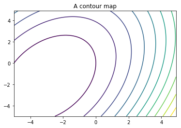

# Chapter 6: Graphs and Plots
<!-- toc orderedList:0 depthFrom:1 depthTo:6 -->

* [Chapter 6: Graphs and Plots](#chapter-6-graphs-and-plots)
  * [6.1 Visualizing Data](#61-visualizing-data)
  * [6.2 The matplotlib Package](#62-the-matplotlib-package)
  * [6.3 Interactive Graphs vs. Image Files](#63-interactive-graphs-vs-image-files)
    * [6.3.1 Interactive Graphs](#631-interactive-graphs)
    * [6.3.2 Savings Graphs to Files](#632-savings-graphs-to-files)
  * [6.4 Plotting Graphs](#64-plotting-graphs)
    * [6.4.1 Lines and Markers](#641-lines-and-markers)
    * [6.4.2 Plotting Several Graphs on One Figure](#642-plotting-several-graphs-on-one-figure)
    * [6.4.3 Line Widths and Marker Sizes](#643-line-widths-and-marker-sizes)
    * [6.4.4 Colors](#644-colors)
  * [6.5 Controlling the Graph](#65-controlling-the-graph)
    * [6.5.1 Axis](#651-axis)
    * [6.5.2 Grid and Ticks](#652-grid-and-ticks)
    * [6.5.3 Subplots](#653-subplots)
    * [6.5.4 Erasing the Graph](#654-erasing-the-graph)
  * [6.6 Adding Text](#66-adding-text)
    * [6.6.1 Title](#661-title)
    * [6.6.2 Axis Labels and Legend](#662-axis-labels-and-legend)
    * [6.6.3 Text Rendering](#663-text-rendering)
    * [6.6.4 Mathematical Symbols and Expressions](#664-mathematical-symbols-and-expressions)
  * [6.7 More Graph Types](#67-more-graph-types)
    * [6.7.1 Bar Charts](#671-bar-charts)
    * [6.7.2 Histograms](#672-histograms)
    * [6.7.3 Pie Charts](#673-pie-charts)
    * [6.7.4 Logarithmic Plots](#674-logarithmic-plots)
    * [6.7.5 Polar Plots](#675-polar-plots)
    * [6.7.6 Stem Plots](#676-stem-plots)
    * [6.7.7 Additional Graphs](#677-additional-graphs)
  * [6.8 Getting and Setting Values](#68-getting-and-setting-values)
    * [6.8.1 Setting Figure and Axis Parameters](#681-setting-figure-and-axis-parameters)
  * [6.9 Patches](#69-patches)
    * [6.9.1 Example: Adding Arrows to a Graph](#691-example-adding-arrows-to-a-graph)
    * [6.9.2 Example: Some Other Patches](#692-example-some-other-patches)
  * [6.10 3D Plots](#610-3d-plots)
  * [6.11 The Basemap Toolkit](#611-the-basemap-toolkit)
    * [6.11.1 Example: French Airports](#6111-example-french-airports)
  * [6.12 Final Notes and References](#612-final-notes-and-references)

<!-- tocstop -->


## 6.1 Visualizing Data

## 6.2 The matplotlib Package

* http://matplotlib.org/
* http://www.wxpython.org/
* http://www.pygtk.org/
* http://matplotlib.sourceforge.net/Matplotlib.pdf

## 6.3 Interactive Graphs vs. Image Files

### 6.3.1 Interactive Graphs

http://www.libpng.org/pub/png/


```python
from pylab import *
```

> Where DOeS thIS FUNCtION COMe FrOM?


```python
help(diff)
```


```python
%pylab inline
plot(range(3))
```

    Populating the interactive namespace from numpy and matplotlib


    C:\Anaconda36\lib\site-packages\IPython\core\magics\pylab.py:161: UserWarning: pylab import has clobbered these variables: ['info', 'random', 'fft', 'linalg', 'draw_if_interactive', 'power']
    `%matplotlib` prevents importing * from pylab and numpy
      "\n`%matplotlib` prevents importing * from pylab and numpy"


    [<matplotlib.lines.Line2D at 0xd6c5578c50>]


### 6.3.2 Savings Graphs to Files


```python
figure()
```


    <matplotlib.figure.Figure at 0xd6c559d4a8>


    <matplotlib.figure.Figure at 0xd6c559d4a8>


```python
plot(arange(3))
```


    [<matplotlib.lines.Line2D at 0xd6c564c978>]


```python
savefig('../images/line.png')
from glob import glob
glob('../images/*.png')
```


```python
from pprint import pprint
pprint(FigureCanvasBase.filetypes)
```

| Parameter   | Description                        | Default Value             | Example                        |
|---|---|---|---|
| dpi         | Resolution in dots per inch        | None                      | savefig(fn, dpi=150)           |
| facecolor*  | The figure’s face color            | 'w'  for white background | savefig(fn, facecolor='b')     |
| transparent | Whether the figure is transparent. | False                     | savefig(fn, transparent=True)  |
| format      | File format                        | 'png'                     | savefig('image', format='pdf') |

## 6.4 Plotting Graphs

http://www.mathworks.com
http://www.gnu.org/software/octave/

### 6.4.1 Lines and Markers


```python
# figure()
y = array([1, 2, -1, 1])
plot(y)
show()
```


```python
# figure()
y = array([1, 2, -1, 1])
t = array([10, 11, 12, 13])
plot(t, y)
show()
```


```python
# figure()
plot(t, y, 'o')
show()
```


| Character | Marker Symbol            |
|---|---|
| 'o'       | Circle                   |
| '^'       | Upward-pointing triangle |
| 's'       | Square                   |
| '+'       | Plus                     |
| 'x'       | Cross (multiplication)   |
| 'D'       | Diamond                  |

| Character(s) | Line Style    |
|---|---|
| '-'          | Solid line    |
| '--'         | Dashed line   |
| '-.'         | Dash-dot line |
| ':'          | Dotted line   |


```python
plot(t, y, 'D-.')
show()
```


### 6.4.2 Plotting Several Graphs on One Figure


```python
%pylab inline
plot(t, y, t, 2*y)
```

    Populating the interactive namespace from numpy and matplotlib


    C:\Anaconda36\lib\site-packages\IPython\core\magics\pylab.py:161: UserWarning: pylab import has clobbered these variables: ['draw_if_interactive', 'fft', 'random', 'linalg', 'info', 'power']
    `%matplotlib` prevents importing * from pylab and numpy
      "\n`%matplotlib` prevents importing * from pylab and numpy"


    [<matplotlib.lines.Line2D at 0x874110de48>,
     <matplotlib.lines.Line2D at 0x874110dfd0>]


```python
plot(t, y, '+', t, 2*y, 's-')
```


    [<matplotlib.lines.Line2D at 0x87411a3080>,
     <matplotlib.lines.Line2D at 0x87411a3208>]


### 6.4.3 Line Widths and Marker Sizes


```python
I = arange(6)
plot(I, sin(I), 'o', I, cos(I), '-', lw=3, ms=8)
title("plot(I, sin(I), 'o', I, cos(I), '-', lw=3, ms=8)")
show()
```


```python
figure(); hold(True)
I = arange(6)
plot(I, sin(I), lw=4)
plot(I, cos(I), lw=2)
show()
```

    C:\Anaconda36\lib\site-packages\ipykernel\__main__.py:1: MatplotlibDeprecationWarning: pyplot.hold is deprecated.
        Future behavior will be consistent with the long-time default:
        plot commands add elements without first clearing the
        Axes and/or Figure.
      if __name__ == '__main__':
    C:\Anaconda36\lib\site-packages\matplotlib\__init__.py:917: UserWarning: axes.hold is deprecated. Please remove it from your matplotlibrc and/or style files.
      warnings.warn(self.msg_depr_set % key)
    C:\Anaconda36\lib\site-packages\matplotlib\rcsetup.py:152: UserWarning: axes.hold is deprecated, will be removed in 3.0
      warnings.warn("axes.hold is deprecated, will be removed in 3.0")


### 6.4.4 Colors

| Character | Color      |
|---|---|
| 'b'       | Blue       |
| 'c'       | Cyan       |
| 'g'       | Green      |
| 'k'       | Black      |
| 'm'       | Magenta    |
| 'r'       | Red        |
| 'w'       | White      |
| 'y'       | Yellow     |


```python
figure()
I = arange(6)
plot(I, sin(I), 'k+-', I, cos(I), 'm:')
show()
```


```python
plot(randn(5), 'y', lw=5) # 'y' from the color table
plot(randn(5), color='yellowgreen', lw=5) # using matplotlib.colors.cname
plot(randn(5), color='#ffff00', lw=5) # explicit yellow RGB
```


    [<matplotlib.lines.Line2D at 0x873ead9f98>]


## 6.5 Controlling the Graph

### 6.5.1 Axis


```python
R = 1.2
I = arange(0, 2*pi, 0.01)
plot(sin(I)*R, cos(I)*R)
show()
```


### 6.5.2 Grid and Ticks


```python
R = 1.2
I = arange(0, 4*pi, 0.01)
plot(sin(I)*R, cos(0.5*I)*R)
axhline(color='gray')
axvline(color='gray')
grid()
xticks([-1, 0, 1], ('Negative', 'Neutral', 'Positive'))
yticks(arange(-1.5, 2.0, 1))
show()
```


### 6.5.3 Subplots


```python
figure()
subplot(2, 1, 1)
title('Upper half')
subplot(2, 2, 3)
title('Lower half, left side')
subplot(2, 2, 4)
title('Lower half, right side')
show()
```


### 6.5.4 Erasing the Graph

The functions cla()  and clf()  clear the axes and the figure, respectively.
These functions are useful when you’re working with an interactive environment and would like to clear the current axes (i.e., set the axes to default values and clear the plotted lines).
It’s also possible to clear the figure altogether, erasing also the axes and subplots, using the clf()  function.
Lastly, you can choose to close the figure window altogether; this is done by calling the function close() .
If you provide a number to close() , the figure associated with the number is closed.
So, close(1)  will close Figure 1, leaving the other figures open.
If you’d like to close all the figures, issue close('all') .


## 6.6 Adding Text

### 6.6.1 Title

| Argument                    | Description                        | Values                                                      |
|---|---|---|
| fontsize                    | Controls the font size             | 'large' , 'medium' , 'small' , or an actual size (i.e., 50) |
| verticalalignment or va     | Controls the vertical alignment    | 'top' , 'baseline' , 'bottom' , 'center'                    |
| horizontalalignment or ha   | Controls the horizontal alignment  | 'center' , 'left' , 'right'                                 |


```python
title('Left aligned, large title', fontsize=24, va='baseline')
```


    <matplotlib.text.Text at 0x873eb75978>


```python
title('Left aligned, large title', fontsize=24)
```


    <matplotlib.text.Text at 0x8740db7b70>


### 6.6.2 Axis Labels and Legend


```python
xlabel('time [seconds]')
```


    <matplotlib.text.Text at 0x87412cde10>


```python
I = arange(0, 2*pi, 0.1)
plot(I, sin(I), '+-', I, cos(I), 'o-')
legend(['sin(I)', 'cos(I)'])
show()
```


```python
I = arange(0, 2*pi, 0.1)
plot(I, sin(I), '+-', label='sin(I)')
plot(I, cos(I), 'o-', label='cos(I)')
legend()
show()
```


### 6.6.3 Text Rendering


```python
figure()
plot([-1, 1], [-1, 1])
text(0, 0, 'origin', va='center', ha='center')
show()
```


### 6.6.4 Mathematical Symbols and Expressions

http://matplotlib.sourceforge.net/users/mathtext.html

* Example: A Summary Graph


```python
I = arange(0, 2*pi+0.1, 0.1)
plot(I, sin(I), label='sin(I)')
title('Function f(x)=sin(x)')
xlabel('x [rad]', va='bottom')
ylabel('sin(x)')
text(pi/2, 1, 'Max value', ha='center', va='bottom')
text(3*pi/2, -1, 'Min value', ha='center', va='top')
xticks(linspace(pi/2, 2*pi, 4), (r'$\frac{\pi}{2}$', r'$\pi$', \
                                 r'$\frac{3\pi}{2}$', r'$2 \pi$'), fontsize=20)
xlim([0, 2*pi])
ylim([-1.2, 1.2])
grid()
show()
```


## 6.7 More Graph Types

### 6.7.1 Bar Charts

* Example: GDP, N Top Countries

https://www.cia.gov/library/publications/the-worldfactbook/rankorder/rawdata_2001.txt


```python
# %load 0053-7-src-Ch06/src/read_world_data.py
import csv, re

def read_world_data(N=10, fn='0053-7-src-Ch06/data/rawdata_2001.txt'):
    """A function to read CIA World Factbook file.

N is the number of countries to process."""

    # initialize return lists
    gdp, labels= [], []

    # read the data and process it
    for i, row in enumerate(csv.reader(open(fn), delimiter='\t')):
        # remove the dollar, comma and space characters
        gdp_value = re.sub(r'[\$, ]', '', row[2])

        # store data in billions of dollars
        gdp.append(float(gdp_value)/1e9)
        labels.append(row[1].strip())

        # stop analyzing the data after N countries have been processed
        if i == N-1:
           break
    return (gdp, labels)


```


```python
# a script to plot GDP bar chart
from pylab import *
from read_world_data import read_world_data
# initialize variables, N is the number of countries
N = 5
gdp, labels = read_world_data(N)
# plot the bar chart
bar(arange(N), gdp, align='center')
# annotate with text
xticks(arange(N), labels, rotation=-10)
for i, val in enumerate(gdp):
    text(i, val/2, str(val), va='center', ha='center', color='yellow')
ylabel('$ (Billions)')
title('GDP rank, data from CIA World Factbook')
show()
```


```python
errorbar(arange(N), gdp, 1000*ones(N), color='k')
show()
```


### 6.7.2 Histograms

* Example: GDP, Histogram


```python
# a script to plot GDP histogram
from pylab import *
from read_world_data import read_world_data

# initialize variables; N is the number of countries, B is the bin size
N, B = 20, 1000

gdp, labels = read_world_data(N)

# plot the histogram
prob, bins, patches = hist(gdp, arange(0, max(gdp)+B,B), align='left')

# annotate with text
for i, p in enumerate(prob):
    percent = '%d%%' % (p/N*100)
    # only annotate non-zero values
    if percent != '0%':
        text(bins[i], p, percent,
            rotation=45, va='bottom', ha='center')
ylabel('Number of countries')
xlabel('Income, billions of dollars')
title('GDP histogram, %d largest economies' % N)

# some axis manipulations
xlim(-B/2, bins[-1]-B/2)
show()
```


### 6.7.3 Pie Charts

* Example: GDP, Pie Chart


```python
# a script to plot GDP pie chart
from pylab import *
from read_world_data import read_world_data
# initialize variables, N is the number of countries
N = 10
gdp, tags = read_world_data(N)
# plot the bar chart
pie(gdp, labels=tags)
axis('equal')
title('GDP rank, data from CIA World Factbook')
show()
```


### 6.7.4 Logarithmic Plots


```python
figure()
I = 2*logspace(1, 5, 5)
I
```


    array([  2.00000000e+01,   2.00000000e+02,   2.00000000e+03,
             2.00000000e+04,   2.00000000e+05])


```python
semilogx(I, [20, 19, 8, 2, 2], '+-', lw=2)
title('Logarithmic plot, semilogx()')
xlabel('Frequency [Hz]')
ylabel('Amplitude [dB]')
grid()
show()
```


```python
def db(x):
    """Returns the value of x, in decibels."""
    return 20*log10(abs(x))

plot(db(array([1000, 980, 970, 400, 30, 2, 1, 1])))
title('Logarithmic plot, dB)')
xlabel('Frequency [Hz]')
ylabel('Amplitude [dB]')
xticks(arange(8), 10**arange(8))
grid()
show()
```


### 6.7.5 Polar Plots


```python
theta = arange(0, 2*pi, 0.01)
polar(theta, cos(theta), theta, -cos(theta))
rgrids([0.5, 1.0], ['Half', 'Full'])
theta_labels = ['0', r'$\frac{\pi}{2}$', r'$\pi$', r'$\frac{3\pi}{2}$']
thetagrids(arange(0, 360, 90), theta_labels, fontsize=20)
title(r'A polar plot of $\pm cos(\theta)$', va='bottom')
show()
```


### 6.7.6 Stem Plots


```python
from pylab import *
N = [4, 8, 16, 64]
for i, n in enumerate(N):
    subplot(2, 2, i+1)
    stem(arange(n), hamming(n))
    xticks(arange(0, n+1, n/4))
    yticks([0, 0.5, 1])
    xlim(-0.5, n+0.5)
    title('N=%d' % n)
show()
```


### 6.7.7 Additional Graphs

* Example: Plotting the Frequency Content of a Signal


```python
from pylab import *
Fs = 256
times = [3, 7, 5]
frequencies = [100, 20, 80]
y = array([])

for t, f in zip(times, frequencies):
    x = cos(2*pi*arange(t*Fs)/Fs*f)
    y = append(y, x)

specgram(y, 256, Fs)
xlabel('Time [sec]')
ylabel('Frequency [Hz]')
axis([0, 14.5, 0, 128])
show()
```


* Example: A Repelling Force Field


```python
from pylab import *
x = arange(-5, 6, 1)
y = arange(-5, 6, 1)
u, v = meshgrid(x, y)
quiver(u, v)
xticks(range(len(x)), x)
yticks(range(len(y)), y)
axis([-1, 11, -1, 11])
axis('scaled')
title('A repelling force field!')
show()
```


* Example: A Contour Plot


```python
from pylab import *
x = arange(-5, 5, 0.1)
y = arange(-5, 5, 0.1)
u, v = meshgrid(x, y)
z = 2*u**2+v**2-u*v+10*u
contour(x, y, z, 10)
title('A contour map')
show()
```





* Example: A Non-Rectangular Contour Plot


```python
from pylab import *
x = linspace(-1.5, 1.5, 1000)
y = linspace(-1.5, 1.5, 1000)
u, v = meshgrid(x, y)
subplot(2, 2, 1)
z = 1-u**2-v**2
z[nonzero(z<0)] = 0
contourf(x, y, sqrt(z), 10)
title('A contour map')
axis('equal')
axis('off')
subplot(2, 2, 2)
z = 1-u**2-v**2
z[nonzero(z<0)] = None
contourf(x, y, sqrt(z), 10)
title('Non-rectangular contour map')
axis('equal')
axis('off')
show()
```


## 6.8 Getting and Setting Values


```python
from pylab import *
p = plot(arange(5))
```


```python
 type(p)
```


    list


```python
type(p[0])
```


    matplotlib.lines.Line2D


```python
setp(p[0])
```

      agg_filter: unknown
      alpha: float (0.0 transparent through 1.0 opaque)
      animated: [True | False]
      antialiased or aa: [True | False]
      axes: an :class:`~matplotlib.axes.Axes` instance
      clip_box: a :class:`matplotlib.transforms.Bbox` instance
      clip_on: [True | False]
      clip_path: [ (:class:`~matplotlib.path.Path`, :class:`~matplotlib.transforms.Transform`) | :class:`~matplotlib.patches.Patch` | None ]
      color or c: any matplotlib color
      contains: a callable function
      dash_capstyle: ['butt' | 'round' | 'projecting']
      dash_joinstyle: ['miter' | 'round' | 'bevel']
      dashes: sequence of on/off ink in points
      drawstyle: ['default' | 'steps' | 'steps-pre' | 'steps-mid' | 'steps-post']
      figure: a :class:`matplotlib.figure.Figure` instance
      fillstyle: ['full' | 'left' | 'right' | 'bottom' | 'top' | 'none']
      gid: an id string
      label: string or anything printable with '%s' conversion.
      linestyle or ls: ['solid' | 'dashed', 'dashdot', 'dotted' | (offset, on-off-dash-seq) | ``'-'`` | ``'--'`` | ``'-.'`` | ``':'`` | ``'None'`` | ``' '`` | ``''``]
      linewidth or lw: float value in points
      marker: :mod:`A valid marker style <matplotlib.markers>`
      markeredgecolor or mec: any matplotlib color
      markeredgewidth or mew: float value in points
      markerfacecolor or mfc: any matplotlib color
      markerfacecoloralt or mfcalt: any matplotlib color
      markersize or ms: float
      markevery: [None | int | length-2 tuple of int | slice | list/array of int | float | length-2 tuple of float]
      path_effects: unknown
      picker: float distance in points or callable pick function ``fn(artist, event)``
      pickradius: float distance in points
      rasterized: [True | False | None]
      sketch_params: unknown
      snap: unknown
      solid_capstyle: ['butt' | 'round' |  'projecting']
      solid_joinstyle: ['miter' | 'round' | 'bevel']
      transform: a :class:`matplotlib.transforms.Transform` instance
      url: a url string
      visible: [True | False]
      xdata: 1D array
      ydata: 1D array
      zorder: any number


```python
setp(p[0], 'visible')
```

      visible: [True | False]


```python
setp(p[0], visible=False)
```


    [None]


```python
setp(p[0], label='Line1')
legend()
show()
```


```python
getp(p[0], 'linewidth')
```

### 6.8.1 Setting Figure and Axis Parameters


```python
setp(gca(), ylabel='Y value')
show()
```


* Example: Modifying Subplot Parameters


```python
from pylab import *
def number_subplots(fignum):
    """Numbers the subplots in a figure."""
    # switch to the requested figure
    figure(fignum)
    fig = gcf()
    for i, fig_axe in enumerate(getp(fig, 'axes')):
        fig_axe.set_title(str(i+1))
    axis()
show()
```


```python
# figure()
ax1 = subplot(2, 1, 1)
ax2 = subplot(2, 1, 2)
```


```python
getp(gcf())
```

        agg_filter = None
        alpha = None
        animated = False
        axes = [<matplotlib.axes._subplots.AxesSubplot object at ...
        children = [<matplotlib.patches.Rectangle object at 0x0000004...
        clip_box = None
        clip_on = True
        clip_path = None
        contains = None
        default_bbox_extra_artists = [<matplotlib.axes._subplots.AxesSubplot object at ...
        dpi = 72.0
        edgecolor = (1.0, 1.0, 1.0, 0.0)
        facecolor = (1.0, 1.0, 1.0, 0.0)
        figheight = 4.0
        figure = None
        figwidth = 6.0
        frameon = True
        gid = None
        label =
        path_effects = []
        picker = None
        rasterized = None
        size_inches = [ 6.  4.]
        sketch_params = None
        snap = None
        tight_layout = False
        transform = IdentityTransform()
        transformed_clip_path_and_affine = (None, None)
        url = None
        visible = True
        window_extent = TransformedBbox(Bbox([[0.0, 0.0], [6.0, 4.0]]), Af...
        zorder = 0


```python
matobj = gcf()
[func for func in dir(matobj) if func.startswith('get')]
```


    ['get_agg_filter',
     'get_alpha',
     'get_animated',
     'get_axes',
     'get_children',
     'get_clip_box',
     'get_clip_on',
     'get_clip_path',
     'get_contains',
     'get_cursor_data',
     'get_default_bbox_extra_artists',
     'get_dpi',
     'get_edgecolor',
     'get_facecolor',
     'get_figheight',
     'get_figure',
     'get_figwidth',
     'get_frameon',
     'get_gid',
     'get_label',
     'get_path_effects',
     'get_picker',
     'get_rasterized',
     'get_size_inches',
     'get_sketch_params',
     'get_snap',
     'get_tight_layout',
     'get_tightbbox',
     'get_transform',
     'get_transformed_clip_path_and_affine',
     'get_url',
     'get_visible',
     'get_window_extent',
     'get_zorder']


## 6.9 Patches

| Patch                        | Description                                                                                                 |
|---|---|
| Arrow(x, y, dx, dy)          | An arrow, starting at location (x, y)  and ending at location (x+dx, y+dy)                                  |
| Circle(xy, r)                | A circle centered at xy and radius r                                                                        |
| Ellipse(xy, w, h, angle)     | An ellipse centered at xy, of width w, height h, and rotated angle degrees                                  |
| Polygon([xy1, xy2, xy3,...]) | A polygon made of vertices specified by xy points                                                           |
| Wedge(xy, r, theta1, theta2) | A wedge (part of a circle) centered at xy, of radius r, starting at angle theta1 and ending at angle theta2 |
| Rectangle(xy, w, h)          | A rectangle, starting at xy, of width w and height h                                                        |

### 6.9.1 Example: Adding Arrows to a Graph


```python
x = arange(10)
y = x**2
plot(x, y)
show()
```


```python
arrows = [(x0, y0, dx, dy) for (x0, y0, dx, dy) in \
          zip(x, y, diff(x), diff(y))]
```


```python
cur_axes = gca()
for x0, y0, dx, dy in arrows:
    cur_axes.add_patch(Arrow(x0, y0, dx, dy))
title('Arrows!')
show()
```


### 6.9.2 Example: Some Other Patches


```python
from pylab import *
# Import Ellipse and Wedge to current namespace
from matplotlib.patches import Ellipse, Wedge
# a list of some patches
my_patches = [
    Arrow(0, 4, 0, -4, facecolor='g'),
    Circle([-2, 2], 1.5, linewidth=4, fc='orange'),
    Ellipse([2, 3], 4, 1, 45.0, edgecolor='r'),
    Polygon([[4, 2], [3, 3], [1, -1], [3, -1]], ls='dashed', fill=False),
    Wedge([-1, 0], 3, 200, 300, fc='m', ec='m'),
    Rectangle([1, -2], 3, -2, fill=False, lw=5, ec='r')
    ]
# draw a figure
figure()
axis([-5, 5, -5, 5])

# add the patches
cur_ax = gca()
for p in my_patches:
    cur_ax.add_patch(p)
title('Patches')
show()
```


## 6.10 3D Plots

http://matplotlib.org/mpl_toolkits/mplot3d/tutorial.html


```python
from pylab import *
from mpl_toolkits.mplot3d import Axes3D
x = linspace(-1, 1, 100)
y = linspace(-1, 1, 100)
u, v = meshgrid(x, y)
fig = figure()
z = 1-u**2-v**2
z[nonzero(z<0)] = 0
ax = fig.gca(projection='3d')
ax.plot_surface(u, v, z)
title('A sphere on a plane')
show()
```


```python
from pylab import *
from mpl_toolkits.mplot3d import Axes3D
N = 50
theta = linspace(0, 2*pi, N)
x = cos(theta)
y = sin(theta)
z = linspace(0, 1, N)
fig = figure()
# first 3D subplot
ax1 = fig.add_subplot(2, 2, 1, projection='3d')
ax1.plot(x, y, z)
title('3D line plot')
# second 3D subplot
ax2 = fig.add_subplot(2, 2, 2, projection='3d')
x = cos(theta) + randn(N)/10
y = sin(theta) + randn(N)/10
z = linspace(0, 1, N)
ax2.scatter(x, y, z)
title('3D scatter plot')
show()
```


## 6.11 The Basemap Toolkit

http://matplotlib.org/basemap/

http://www.lfd.uci.edu/~gohlke/pythonlibs/#basemap

### 6.11.1 Example: French Airports

* http://weather.rap.ucar.edu/surface/stations.txt
* http://matplotlib.org/basemap/users/download.html


```python
from pylab import *
from mpl_toolkits.basemap import Basemap
# read METAR airport codes, retrieve lat/lon values
airports = {}
metar_codes = open('data/stations.txt').readlines()
for row in metar_codes:
    code = row[20:24] # METAR code
    if(code.startswith('LF')):
        lat = float(row[39:41])+float(row[42:44])/60
        lon = float(row[47:50])+float(row[51:53])/60
        if(row[53]=='W'): lon = -lon
        if(row[44]=='S'): lat = -lat
        name = row[:20].split('/')[0].strip().title()
        airports[code] = [lon, lat, name]
# draw the map
m = Basemap(llcrnrlon=-5.0, llcrnrlat=41.0, urcrnrlon=10.0, urcrnrlat=51.5,
            projection='merc', resolution='h', suppress_ticks=False)
m.drawcoastlines()
m.bluemarble(scale=0.5)
m.drawmapboundary(fill_color='lightblue')
m.drawcountries(linewidth=1)
m.drawmapscale(-2.0, 41.5, -2.0, 41.5, 500, units='km')
axis('off')
# plot the airports
for site, [lon, lat, name] in airports.items():
    xpt, ypt = m(lon, lat)
    text(xpt, ypt, ' '+name, va='center', ha='left', fontsize=9, color='white')
    plot(xpt, ypt, 'wo')
title('METAR sites in France')
show()
```


## 6.12 Final Notes and References

* The matplotlib website, http://matplotlib.org/
* The Mplot3d toolkit, http://matplotlib.org/mpl_toolkits/mplot3d/tutorial.html
* The basemap toolkit, http://matplotlib.org/basemap/
