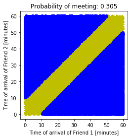
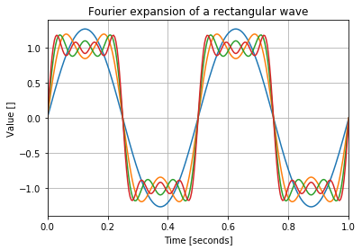

# Chapter 7: Math Games
<!-- toc orderedList:0 depthFrom:1 depthTo:6 -->

* [Chapter 7: Math Games](#chapter-7-math-games)
  * [7.1 Preprocessing Data Prior to Visualization](#71-preprocessing-data-prior-to-visualization)
  * [7.2 Modules math and cmath](#72-modules-math-and-cmath)
    * [7.2.1 Example: Mandelbrot Set](#721-example-mandelbrot-set)
    * [7.2.2 Example: A Newton Fractal](#722-example-a-newton-fractal)
  * [7.3 Module decimal](#73-module-decimal)
  * [7.4 Module fractions](#74-module-fractions)
  * [7.5 Module random](#75-module-random)
    * [7.5.1 Using Module random to Solve Probability Questions](#751-using-module-random-to-solve-probability-questions)
    * [7.5.2 Random Sequences](#752-random-sequences)
  * [7.6 Module NumPy](#76-module-numpy)
    * [7.6.1 Array Creation](#761-array-creation)
    * [7.6.2 Slicing, Indexing, and Reshaping](#762-slicing-indexing-and-reshaping)
    * [7.6.3 N-Dimensional Arrays](#763-n-dimensional-arrays)
    * [7.6.4 Math Functions](#764-math-functions)
    * [7.6.5 Array Methods and Properties](#765-array-methods-and-properties)
    * [7.6.6 Other Useful Array Functions](#766-other-useful-array-functions)
  * [7.7 Final Notes and References](#77-final-notes-and-references)

<!-- tocstop -->


## 7.1 Preprocessing Data Prior to Visualization

## 7.2 Modules math and cmath


```python
import math
math.sqrt(-1)
```


    ---------------------------------------------------------------------------

    ValueError                                Traceback (most recent call last)

    <ipython-input-150-6557c4e6d55f> in <module>()
          1 import math
    ----> 2 math.sqrt(-1)


    ValueError: math domain error


```python
import cmath
cmath.sqrt(-1)
```


    1j


```python
from math import ceil
ceil(2.5)
```


    3


```python
type(ceil(2.5))
```


    int


```python
from math import ceil
ceil(2.5)
```


    3


```python
type(ceil(2.5))
```


    int


### 7.2.1 Example: Mandelbrot Set


```python
c=0.4+1j*0.5
```


```python
z=0
```


```python
z=z**2+c; print(z, abs(z))
```

    (0.4+0.5j) 0.6403124237432849


```python
z=z**2+c; print(z, abs(z))
```

    (0.31000000000000005+0.9j) 0.9518928511129812


```python
z=z**2+c; print(z, abs(z))
```

    (-0.31389999999999996+1.0580000000000003j) 1.1035838028894773


```python
z=z**2+c; print(z, abs(z))
```

    (-0.6208307900000004-0.16421240000000004j) 0.64218111318053


```python
z=z**2+c; print(z, abs(z))
```

    (0.7584651574982646+0.7038962280395922j) 1.0347653332940918


```python
z=z**2+c; print(z, abs(z))
```

    (0.4797994952905018+1.5677615269249674j) 1.6395376668399924


```python
z=z**2+c; print(z, abs(z))
```

    (-1.827668649625085+2.0044223787089317j) 2.7125784348275634


```python
# %load 0053-7-src-Ch07/src/mandelbrot.py
from PIL import Image, ImageOps

# creates an image of the Mandelbrot set
res = 400
iters = 200

img = Image.new("L", (res, res), 255)
for im in range(res):
    for re in range(res):
        z = 0
        # a scaling to show the "interesting" part of the Mandelbrot fractal
        c = (re*2/res-1.5)+1j*(im*2/res-1)
        for k in range(iters):
            z = z**2+c
            if abs(z)>2:
#                 print(type((re,im)))
#                 print(255-k*255/iters)
                img.putpixel((re, im), int(255-k*255/iters))
#                 img.putpixel((re, im), 255)
                break

# create a uniform distribution of gray levels
img = ImageOps.equalize(img)

# save to file
img.save('images/mandelbrot_%d_%d.png' % (iters, res), dpi=(150,150))
```


### 7.2.2 Example: A Newton Fractal

* Note If you’d like to read more about Newton’s method, have a look at http://en.wikipedia.org/wiki/Newton%27s_method; there’s a lot of additional information available on the Internet.


```python
from cmath import pi, cos, sin
solutions = [ cos((2*n+1)*pi/4) + \
             1j*sin((2*n+1)*pi/4) for n in range(4)]
```


```python
from pprint import pprint
pprint([ z**4 for z in solutions])
```

    [(-1.0000000000000004+0j),
     (-1+4.440892098500626e-16j),
     (-1.0000000000000004+6.661338147750941e-16j),
     (-1+8.881784197001252e-16j)]


```python
# %load 0053-7-src-Ch07/src/newton.py
from PIL import Image
from cmath import *

# creates a z**4+1 = 0 fractal using the Newton-Raphson
# root finding method
delta       = 0.000001  # convergence criteria
res         = 800       # image size
iters       = 30        # number of iterations

# create an image to draw on, paint it black
img = Image.new("RGB", (res, res), (0, 0, 0))

# these are the solutions to the equation z**4+1 = 0 (Euler's formula)
solutions = [cos((2*n+1)*pi/4)+1j*sin((2*n+1)*pi/4) for n in range(4)]
colors = [(1, 0, 0), (0, 1, 0), (0, 0, 1), (1, 1, 0)]

for re in range(res):
    for im in range(res):
        z = (re+1j*im)/res
        for i in range(iters):
            try:
                z -= (z**4+1)/(4*z**3)
            except ZeroDivisionError:
                # possibly divide by zero exception
                continue
            if(abs(z**4+1)<delta):
                break

        # color depth is a function of the number of iterations
        color_depth = int((iters-i)*255.0/iters)

        # find to which solution this guess converged to
        err = [ abs(z-root) for root in solutions ]
        distances = zip(err, range(len(colors)))

        # select the color associated with the solution
        color = [i*color_depth for i in colors[min(distances)[1]]]
        img.putpixel((re, im), tuple(color))

img.save('images/newton_z4s_%03d_%03d_%03d.png' % \
    (iters, res, abs(log10(delta))), dpi=(150,150))

```


```python
from cmath import sqrt
z=sqrt(2)/2*(1+1j)
z
```


    (0.7071067811865476+0.7071067811865476j)


```python
err = [abs(z-root) for root in solutions]
err
```


    [0.0, 1.414213562373095, 2.0, 1.4142135623730954]


```python
zip(err, range(len(colors)))
list(_)
```


    [0.0, 1.414213562373095, 2.0, 1.4142135623730954]


```python
distances = list(zip(err, range(len(colors))))
min(distances)
```


    (0.0, 0)


```python
min(distances)[1]
```


    0


```python
colors[min(distances)[1]]
```


    (1, 0, 0)


```python
color = [i*color_depth for i in colors[min(distances)[1]]]
img.putpixel((re, im), tuple(color))
```


```python
'../images/newton_z4s_%03d_%03d_%03d.png' % (iters, res, abs(log10(delta)))
```


    '../images/newton_z4s_030_800_005.png'


## 7.3 Module decimal

https://docs.python.org/3.3/library/decimal.html.


```python
from decimal import *
Decimal('3.3')
```


    Decimal('3.3')


```python
Decimal(3.3)
```


    Decimal('3.29999999999999982236431605997495353221893310546875')


```python
a = Decimal('3.3')
a*a
```


    Decimal('10.89')


```python
a-13
```


    Decimal('-9.7')


```python
a = Decimal('3.3')
sqrt(a)
```


    (1.816590212458495+0j)


```python
exp(Decimal('1'))
```


    (2.718281828459045+0j)


## 7.4 Module fractions

https://docs.python.org/3.3/library/fractions.html.


```python
from fractions import *
Fraction(2, 7)
```


    Fraction(2, 7)


```python
Fraction('2/7')
```


    Fraction(2, 7)


```python
Fraction(_)
```


    Fraction(2, 7)


```python
Fraction(1.22)
```


    Fraction(5494391545392005, 4503599627370496)


```python
Fraction(3, 4)**2
```


    Fraction(9, 16)


```python
Fraction('3.14')
```


    Fraction(157, 50)


```python
Fraction(22, 7) - Fraction('3.14')
```


    Fraction(1, 350)


## 7.5 Module random

### 7.5.1 Using Module random to Solve Probability Questions

* Example: Hard Disk Head


```python
from random import random
N = 1000 # number of files the head seeks
tot_dist = 0
for i in range(N):
    tot_dist += random()*2
tot_dist/N
```


    0.9892843378341475


```python
from random import random
N = 1000 # number of files the head seeks
tot_dist, cur_loc = 0, 0
for i in range(N):
    new_loc = random()
    tot_dist += abs(cur_loc-new_loc)
    cur_loc = new_loc
tot_dist/N
```


    0.3233488270588347


* Example: Friends Meeting


```python
from random import random
from pylab import *

N = 40000 # number of events
# generate N events of friends times
friend1, friend2 = [], []

for i in range(N):
    friend1.append(random())
    friend2.append(random())

# find all occurrences of friends meeting
met = array([ (x, y) for (x, y) in zip(friend1, friend2) \
             if abs(y-x) < 1.0/6 ])

not_met = array([ (x, y) for (x, y) in zip(friend1, friend2) \
                 if abs(y-x) >=1.0/6 ])

# plot the result, this might shed some light on the problem!
plot(met[:, 0], met[:,1 ], 'y+', mec='y')
plot(not_met[:, 0], not_met[:, 1], 'bo', mec='b')
title("Probability of meeting: %1.3f" % (float(len(met))/N))
xlabel('Time of arrival of Friend 1 [minutes]')
ylabel('Time of arrival of Friend 2 [minutes]')
xticks([n/6 for n in range(7)], [n*10 for n in range(7)])
yticks([n/6 for n in range(7)], [n*10 for n in range(7)])
axis('scaled')
show()
```





### 7.5.2 Random Sequences

| Function     | Description                                   |
|---|---|
| choice(s)    | Returns a random element from the sequence s. |
| shuffle(s)   | Shuffles the sequence s.                      |
| sample(s, n) | Returns a subsequence of size n from s.       |


```python
from random import choice, shuffle, sample
cards = list(zip(list(range(1, 14))*4, 'S'*13+'H'*13+'D'*13+'C'*13))
cards[:5]
```


    [(1, 'S'), (2, 'S'), (3, 'S'), (4, 'S'), (5, 'S')]


```python
choice(cards)
```


    (10, 'C')


```python
shuffle(cards)
cards[:5]
```


    [(9, 'H'), (11, 'H'), (8, 'D'), (5, 'C'), (6, 'C')]


```python
sample(cards, 5)
```


    [(8, 'H'), (5, 'H'), (2, 'D'), (3, 'H'), (2, 'C')]


## 7.6 Module NumPy

### 7.6.1 Array Creation


```python
from numpy import *
v = array([1, 2])
v
```


    array([1, 2])


```python
type(v)
```


    numpy.ndarray


```python
m = array([[1, 0],[0, 4]])
m
```


    array([[1, 0],
           [0, 4]])


```python
type(m)
```


    numpy.ndarray


| Function |
|---|
| N-Dimensional Arrays |
| array(s) |
| ones(t) |
| arange([start,] stop[, step]) |
| linspace(start, stop, num=50) |
| logspace(start, stop, num=50) |

### 7.6.2 Slicing, Indexing, and Reshaping


```python
a = arange(12).reshape(4, 3)
a
```


    array([[ 0,  1,  2],
           [ 3,  4,  5],
           [ 6,  7,  8],
           [ 9, 10, 11]])


```python
a[1]
```


    array([3, 4, 5])


```python
a[-1]
```


    array([ 9, 10, 11])


```python
a[1, 1]
```


    4


```python
a[:, 1]
```


    array([ 1,  4,  7, 10])


```python
a[1, :2]
```


    array([3, 4])


### 7.6.3 N-Dimensional Arrays


```python
ones((2, 3, 4))
```


    array([[[ 1.,  1.,  1.,  1.],
            [ 1.,  1.,  1.,  1.],
            [ 1.,  1.,  1.,  1.]],

           [[ 1.,  1.,  1.,  1.],
            [ 1.,  1.,  1.,  1.],
            [ 1.,  1.,  1.,  1.]]])


```python
a = ones((2, 3, 4))
a
```


    array([[[ 1.,  1.,  1.,  1.],
            [ 1.,  1.,  1.,  1.],
            [ 1.,  1.,  1.,  1.]],

           [[ 1.,  1.,  1.,  1.],
            [ 1.,  1.,  1.,  1.],
            [ 1.,  1.,  1.,  1.]]])


```python
a[0,...]
```


    array([[ 1.,  1.,  1.,  1.],
           [ 1.,  1.,  1.,  1.],
           [ 1.,  1.,  1.,  1.]])


```python
a[0, 1, ...]
```


    array([ 1.,  1.,  1.,  1.])


* Example: Comparing Mortgages

http://en.wikipedia.org/wiki/Fixed-rate_mortgage

> the CONVeNIeNCe OF USING araNGe( ) aND LINSpaCe( )


```python
interest_rates = [x/2.0+3 for x in range(5)]
```


```python
interest_rates = arange(3.0, 5.5, 0.5)
```


```python
interests = linspace(3.0, 5.0, 5)
```


```python
# %load 0053-7-src-Ch07/src/ndflat.py
from numpy import *
loans           = arange(100000, 160000, 20000)
num_payments    = arange(5, 30, 5)*12
interests       = arange(3, 5.5, 0.5)/100.0/12.0

# method 1, storing results in a list
res1 = []

# method 2, storing results in an array
res2 = zeros([len(loans), len(num_payments), len(interests)])

for i, loan in enumerate(loans):
    for j, num_pay in enumerate(num_payments):
        for k, interest in enumerate(interests):
            res1.append([loan, num_pay, interest, \
                -pmt(interest, num_pay, loan)])
            res2[i][j][k]=-pmt(interest, num_pay, loan)

```


```python
exec(open('0053-7-src-Ch07/src/ndflat.py').read())
for row in res1:
    if(row[0] == 120000 and row[1] == 120):
        print(row)
```

    [120000, 120, 0.0025000000000000001, 1158.7289363806954]
    [120000, 120, 0.0029166666666666668, 1186.6304095428363]
    [120000, 120, 0.0033333333333333335, 1214.941657978555]
    [120000, 120, 0.0037499999999999999, 1243.6609050842044]
    [120000, 120, 0.0041666666666666666, 1272.7861828689065]


```python
res2[1, 1, ...]
```


    array([ 1158.72893638,  1186.63040954,  1214.94165798,  1243.66090508,
            1272.78618287])


```python
values = res2[1, 1, :]
for i, v in enumerate(values):
    row = [loans[1], num_payments[1], interests[i], v]
    print(row)
```

    [120000, 120, 0.0025000000000000001, 1158.7289363806954]
    [120000, 120, 0.0029166666666666668, 1186.6304095428363]
    [120000, 120, 0.0033333333333333335, 1214.941657978555]
    [120000, 120, 0.0037499999999999999, 1243.6609050842044]
    [120000, 120, 0.0041666666666666666, 1272.7861828689065]


```python
exec(open('0053-7-src-Ch07/src/ndflat.py').read())
res2.shape
```


    (3, 5, 5)


```python
[n1, n2, n3] = [range(i) for i in res2.shape]
n1, n2, n3
```


    (range(0, 3), range(0, 5), range(0, 5))


### 7.6.4 Math Functions

* Example: Visualizing Fourier Expansion of a Rectangular Wave


```python
# plots a Fourier expansion of a rectangular wave
from pylab import *
# prepare the plot
figure()
hold(True)
# number of points to display the wave
N = 2**8
t = linspace(0, 1, N)
y = zeros(N)
for n in range(1, 8, 2):
    # the sine waves, added
    y += 4/(pi*n)*sin(2*pi*n*t*2)
    # plot the graph
    plot(t, y)

# annotate the graph
axis([0, 1, -1.4, 1.4])
grid()
xlabel('Time [seconds]')
ylabel('Value []')
title('Fourier expansion of a rectangular wave')
show()
```

    C:\Anaconda36\lib\site-packages\ipykernel\__main__.py:5: MatplotlibDeprecationWarning: pyplot.hold is deprecated.
        Future behavior will be consistent with the long-time default:
        plot commands add elements without first clearing the
        Axes and/or Figure.
    C:\Anaconda36\lib\site-packages\matplotlib\__init__.py:917: UserWarning: axes.hold is deprecated. Please remove it from your matplotlibrc and/or style files.
      warnings.warn(self.msg_depr_set % key)
    C:\Anaconda36\lib\site-packages\matplotlib\rcsetup.py:152: UserWarning: axes.hold is deprecated, will be removed in 3.0
      warnings.warn("axes.hold is deprecated, will be removed in 3.0")





### 7.6.5 Array Methods and Properties


```python
import numpy
[m for m in dir(numpy.ndarray) if not(m.startswith('__'))]
```


    ['T',
     'all',
     'any',
     'argmax',
     'argmin',
     'argpartition',
     'argsort',
     'astype',
     'base',
     'byteswap',
     'choose',
     'clip',
     'compress',
     'conj',
     'conjugate',
     'copy',
     'ctypes',
     'cumprod',
     'cumsum',
     'data',
     'diagonal',
     'dot',
     'dtype',
     'dump',
     'dumps',
     'fill',
     'flags',
     'flat',
     'flatten',
     'getfield',
     'imag',
     'item',
     'itemset',
     'itemsize',
     'max',
     'mean',
     'min',
     'nbytes',
     'ndim',
     'newbyteorder',
     'nonzero',
     'partition',
     'prod',
     'ptp',
     'put',
     'ravel',
     'real',
     'repeat',
     'reshape',
     'resize',
     'round',
     'searchsorted',
     'setfield',
     'setflags',
     'shape',
     'size',
     'sort',
     'squeeze',
     'std',
     'strides',
     'sum',
     'swapaxes',
     'take',
     'tobytes',
     'tofile',
     'tolist',
     'tostring',
     'trace',
     'transpose',
     'var',
     'view']


* Example: A Magic Square


```python
from pylab import *
def magicsq(n=3):
    """Returns a magic square of size n; n must be odd"""
    if n % 2 != 1:
        raise ValueError("Magic(n) requires n to be odd")
    m, row, col = zeros([n, n]), 0, n//2

    for num in range(1, n**2+1):
        m[row, col] = num # fill the cell
        col = (col+1) % n
        row = (row-1) % n
        if m[row, col]:
            col = (col-1) % n
            row = (row+2) % n
    return m

def testmagicsq(m):
    """Returns True if m is a magic square."""
    msum = sum(m[0, :])
    return all(m.sum(0) == msum) and all(m.sum(1) == msum)
```


```python
exec(open('0053-7-src-Ch07/src/magic_square.py').read())
a = eye(2, 3)
a
```


    array([[ 1.,  0.,  0.],
           [ 0.,  1.,  0.]])


```python
a.sum(0)
```


    array([ 1.,  1.,  0.])


```python
a.sum(1)
```


    array([ 1.,  1.])


```python
m = magicsq(5)
m.sum(0)
```


    array([ 65.,  65.,  65.,  65.,  65.])


```python
m.sum(1)
```


    array([ 65.,  65.,  65.,  65.,  65.])


```python
testmagicsq(m)
```


    True


```python
m = magicsq(5)
m.trace()
```


    65.0


```python
fliplr(m).trace()
```


    65.0


### 7.6.6 Other Useful Array Functions


```python
import numpy
dir(numpy)
```


```python
help(numpy.diff)
```

    Help on function diff in module numpy.lib.function_base:

    diff(a, n=1, axis=-1)
        Calculate the n-th discrete difference along given axis.

        The first difference is given by ``out[n] = a[n+1] - a[n]`` along
        the given axis, higher differences are calculated by using `diff`
        recursively.

        Parameters
        ----------
        a : array_like
            Input array
        n : int, optional
            The number of times values are differenced.
        axis : int, optional
            The axis along which the difference is taken, default is the last axis.

        Returns
        -------
        diff : ndarray
            The n-th differences. The shape of the output is the same as `a`
            except along `axis` where the dimension is smaller by `n`.

        See Also
        --------
        gradient, ediff1d, cumsum

        Examples
        --------
        >>> x = np.array([1, 2, 4, 7, 0])
        >>> np.diff(x)
        array([ 1,  2,  3, -7])
        >>> np.diff(x, n=2)
        array([  1,   1, -10])

        >>> x = np.array([[1, 3, 6, 10], [0, 5, 6, 8]])
        >>> np.diff(x)
        array([[2, 3, 4],
               [5, 1, 2]])
        >>> np.diff(x, axis=0)
        array([[-1,  2,  0, -2]])


## 7.7 Final Notes and References

* NumPy home page, http://www.numpy.org/
* The Python Standard Library, https://docs.python.org/3.3/library/index.html
* “Mandelbrot set,” Wikipedia, http://en.wikipedia.org/wiki/Mandelbrot_set
* “Newton’s method,” Wikipedia, http://en.wikipedia.org/wiki/Newton%27s_method
* “De la Loubère Method,” Wikipedia, http://en.wikipedia.org/wiki/Siamese_method
* “Fourier Series,” Wikipedia, http://en.wikipedia.org/wiki/Fourier_series
