# Chapter 8: Science and Visualization
<!-- toc orderedList:0 depthFrom:1 depthTo:6 -->

* [Chapter 8: Science and Visualization](#chapter-8-science-and-visualization)
  * [8.1 Numerical Analysis and Signal Processing](#81-numerical-analysis-and-signal-processing)
  * [8.2 Finding Your Way: Variables and Functions](#82-finding-your-way-variables-and-functions)
    * [8.2.1 SciPy](#821-scipy)
  * [8.3 Linear Algebra](#83-linear-algebra)
    * [8.3.1 Solving a System of Linear Equations](#831-solving-a-system-of-linear-equations)
    * [8.3.2 Vector and Matrix Operations](#832-vector-and-matrix-operations)
    * [8.3.3 Matrix Decomposition](#833-matrix-decomposition)
    * [8.3.4 Additional Linear Algebra Functionality](#834-additional-linear-algebra-functionality)
  * [8.4 Numerical Integration](#84-numerical-integration)
    * [8.4.1 More Integration Methods](#841-more-integration-methods)
  * [8.5 Interpolation and Curve Fitting](#85-interpolation-and-curve-fitting)
    * [8.5.1 Piecewise Linear Interpolation](#851-piecewise-linear-interpolation)
    * [8.5.2 Polynomials](#852-polynomials)
    * [8.5.3 Uses of Polynomials](#853-uses-of-polynomials)
    * [8.5.6 Spline Interpolation](#856-spline-interpolation)
  * [8.6 Solving Nonlinear Equations](#86-solving-nonlinear-equations)
  * [8.7 Special Functions](#87-special-functions)
  * [8.8 Signal Processing](#88-signal-processing)
    * [8.8.1 Functions find, nonzero, where and select](#881-functions-find-nonzero-where-and-select)
    * [8.8.2 Listing 8-3. Randomly Placing Triangular Spikes](#882-listing-8-3-randomly-placing-triangular-spikes)
    * [8.8.3 Listing 8-4. Detecting Signals (a Continuation of Listing 8-3](#883-listing-8-4-detecting-signals-a-continuation-of-listing-8-3)
    * [8.8.4 Functions diff and split](#884-functions-diff-and-split)
    * [8.8.5 Listing 8-5. Peak Detections](#885-listing-8-5-peak-detections)
    * [8.8.6 Waveforms](#886-waveforms)
  * [8.9 Fourier Transform](#89-fourier-transform)
    * [8.9.1 Example: FFT of a Sampled Cosine Wave](#891-example-fft-of-a-sampled-cosine-wave)
    * [8.9.2 Window Functions](#892-window-functions)
  * [8.10 Filtering](#810-filtering)
    * [8.10.1 Filter Design](#8101-filter-design)
    * [8.10.2 Example: A Heart-Rate Monitor](#8102-example-a-heart-rate-monitor)
    * [8.10.3 Example: Moving Average](#8103-example-moving-average)
  * [8.11 Final Notes and References](#811-final-notes-and-references)

<!-- tocstop -->


## 8.1 Numerical Analysis and Signal Processing

## 8.2 Finding Your Way: Variables and Functions


```python
from pylab import *
who()
```

    Name            Shape            Bytes            Type
    ===========================================================

    up              10               40               int32
    down            10               40               int32

    Upper bound on total bytes  =       80


```python
up, down = arange(10), arange(10, 0, -1)
who()
```

    Name            Shape            Bytes            Type
    ===========================================================

    up              10               40               int32
    down            10               40               int32

    Upper bound on total bytes  =       80


```python
lookfor('integrate')
```

    Search results for 'integrate'
    ------------------------------
    numpy.trapz
        Integrate along the given axis using the composite trapezoidal rule.
    numpy.polynomial.Hermite._int
        Integrate a Hermite series.
    numpy.polynomial.HermiteE._int
        Integrate a Hermite_e series.
    numpy.polynomial.Laguerre._int
        Integrate a Laguerre series.
    numpy.polynomial.Legendre._int
        Integrate a Legendre series.
    numpy.polynomial.Chebyshev._int
        Integrate a Chebyshev series.
    numpy.polynomial.Chebyshev.integ
        Integrate.
    numpy.polynomial.Polynomial._int
        Integrate a polynomial.
    numpy.alterdot
        Change `dot`, `vdot`, and `inner` to use accelerated BLAS functions.
    numpy.restoredot
        Restore `dot`, `vdot`, and `innerproduct` to the default non-BLAS
    numpy.polynomial.hermite.hermgauss
        Gauss-Hermite quadrature.
    numpy.polynomial.laguerre.laggauss
        Gauss-Laguerre quadrature.
    numpy.polynomial.legendre.leggauss
        Gauss-Legendre quadrature.
    numpy.polynomial.chebyshev.chebgauss
        Gauss-Chebyshev quadrature.
    numpy.polynomial.hermite_e.hermegauss
        Gauss-HermiteE quadrature.

### 8.2.1 SciPy

SciPy (http://www.scipy.org/) is an open source scientific library for Python.
The idea of SciPy is similar to that of Octave-Forge (http://octave.sourceforge.net/), which provides extra packages for GNU-Octave (http://www.octave.org) and toolboxes that enhance MATLAB (http://www.mathworks.com).
SciPy is built on top of NumPy, so it requires NumPy to work properly.
SciPy is organized into several modules, some of which are detailed in Table 8-1.


| Package      | Description                                                      |
|---|---|
| Fftpack      | Fast Fourier Transform                                           |
| Integrate    | Integration functions, including ordinary differential equations |
| Interpolate  | Interpolation of functions                                       |
| Linalg       | Linear algebra                                                   |
| Optimize     | Optimization functions, including root-solving algorithms        |
| Signal       | Signal processing                                                |
| Special      | Special functions (Airy, Bessel, etc.)                           |


```python
import scipy as sp
```


```python
dir(sp)
```


```python
import scipy.linalg
```


```python
from scipy import linalg
```

## 8.3 Linear Algebra

### 8.3.1 Solving a System of Linear Equations


```python
from pylab import *
M = array([[ 2, 3], [3, -1]])
```


```python
V = array([10, -1.5])
```


```python
solve(M, V)
```


    array([ 0.5,  3. ])


```python
dot(inv(M), V)
```


    array([ 0.5,  3. ])


```python
inv(M)*V
```


    array([[ 0.90909091, -0.40909091],
           [ 2.72727273,  0.27272727]])


### 8.3.2 Vector and Matrix Operations


```python
dot(inv(M)[0], V)
```


    0.50000000000000022


```python
V1 = array([10, -1.5])
V2 = array([1, 2])
sum = 0
for i in range(len(V1)):
    sum += V1[i]*V2[i]
sum
```


    7.0


```python
inner(V1, V2)
```


    7.0


```python
M = array([[2, 3], [3, -1]])
M
```


    array([[ 2,  3],
           [ 3, -1]])


```python
inner(M, inv(M))
```


    array([[  1.00000000e+00,   1.11022302e-16],
           [  5.55111512e-17,   1.00000000e+00]])


```python
V1 = array([10, -1.5])
V2 = array([1, 2])
outer(V1, V2)
```


    array([[ 10. ,  20. ],
           [ -1.5,  -3. ]])


```python
V1 = array([10, -1.5])
V2 = array([1, 2])
outer(V1, V2)
```


    array([[ 10. ,  20. ],
           [ -1.5,  -3. ]])


```python
outer(V2, V1)
```


    array([[ 10. ,  -1.5],
           [ 20. ,  -3. ]])


```python
all(outer(V1, V2) == transpose(outer(V2, V1)))
```


    True


```python
conjugate(V1+1j*V2)
```


    array([ 10.0-1.j,  -1.5-2.j])


```python
det(array([[2, 3], [3, -1]]))
```


    -11.000000000000002


### 8.3.3 Matrix Decomposition

| Function    | Description                  |
|---|---|
| cholesky(m) | Cholesky decomposition       |
| eig(m)      | Eigenvalue decomposition     |
| qr(m)       | QR decomposition             |
| svd(m)      | Singular value decomposition |


```python
A = array([[1, 2], [0, 1]])
L, v = eig(A) # calculate eigenvalues and eigenvectors
det(A - eye(2)*L) # verify eigenvalues (should be zero)
```


    0.0


```python
dot(A, v[:, 0]) - L[0]*v[:, 0] # verify 1st eigenvector (should be 0)
```


    array([ 0.,  0.])


```python
dot(A, v[:, 1]) - L[1]*v[:, 1] # verify 2nd eigenvector (should be 0)
```


    array([  2.22044605e-16,   0.00000000e+00])


### 8.3.4 Additional Linear Algebra Functionality

Additional linear algebra functionality is available with the scipy.linalg module. To access SciPy’s linear algebra function issue import scipy.linalg or from scipy import linalg. SciPy’s added functionality includes the following:
* Matrix decomposition functions: lu()  for LU decomposition and qr()  for QR matrix decomposition, as well as functions for other decompositions.
* Matrix and vector operators such as norm()  to calculate a matrix or vector norm, det()  to calculate the determinant of a matrix, and inv() to invert a matrix.
* Matrix functions like expm()  and tanm() . Matrix function names are similar to regular function names, but with an added character, m.
* Special matrices, such as the Hadamard matrix (hadamard() ) used in some error correction codes (see http://en.wikipedia.org/wiki/Hadamard_matrix) and the Hilbert matrix (hilbert() ) (see http://en.wikipedia.org/wiki/Hilbert_matrix).


## 8.4 Numerical Integration


```python
N = 7
x = linspace(-1, 1, N)
y = sqrt(1-x**2)
x**2 + y**2
```


    array([ 1.,  1.,  1.,  1.,  1.,  1.,  1.])


```python

```


```python
figure()
dx = x[1]-x[0]
for i in range(len(x)-1):
    rect = Rectangle((x[i], 0), dx, 0.5*(y[i]+y[i+1]))
    gca().add_patch(rect)
title('Approximating the area of half a circle')
axis('equal')
show()
```


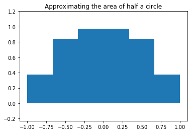


```python
from numpy import *
```


```python
dx*(sum(y[:-1]+y[1:]))
```


    2.7320508075688772


```python
for N in [5, 10, 20, 100]:
    x = linspace(-1, 1, N)
    dx = x[1]-x[0]
    y = sqrt(1-x**2)
    est_pi = dx*sum(y[:-1]+y[1:])
    print("N=%d, estimated pi is %f" % (N, est_pi))
```

    N=5, estimated pi is 2.732051
    N=10, estimated pi is 3.019232
    N=20, estimated pi is 3.101560
    N=100, estimated pi is 3.138218


```python
x = array([-1, -0.9, -0.4, 0.0, 0.4, 0.9, 1])
y = sqrt(1-x**2)
trapz(y, x)*2
```


    2.9727951234089831


### 8.4.1 More Integration Methods


```python
from scipy.integrate import quad
def half_circle(x):
    return sqrt(1-x**2)

pi_half, err = quad(half_circle, -1, 1)
(pi_half*2, err)
```


    (3.141592653589797, 1.0002356720661965e-09)


http://www.scipy.org/

## 8.5 Interpolation and Curve Fitting

> INVerSe SQUare rOOt aND QUaKe III
http://www.lomont.org/Math/Papers/2003/InvSqrt.pdf

### 8.5.1 Piecewise Linear Interpolation


```python
xp = linspace(0, 1, 6)
xp
```


    array([ 0. ,  0.2,  0.4,  0.6,  0.8,  1. ])


```python
yp = sqrt(1-xp**2)
```


```python
xi = arange(0.1, 1.0, 0.2)
yi = interp(xi, xp, yp)
```


```python
from pylab import *
figure()
hold(True)
x = linspace(0, 1, 500)
y = sqrt(1-x**2)
xp = linspace(0, 1, 6)
yp = sqrt(1-xp**2)
xi = arange(0.1, 1.0, 0.2)
yi = interp(xi, xp, yp)
plot(x, y, 'b', label='ideal')
plot(xp, yp, 'or', label='interpolation points')
plot(xp, yp, '--r', label='piecewise linear function')
plot(xi, yi, 'sg', label='interpolated values')
legend(loc='best')
grid()
axis('scaled')
axis([0, 1.1, 0, 1.1])
title('Piecewise linear interpolation')
show()
```

    C:\Anaconda36\lib\site-packages\ipykernel\__main__.py:3: MatplotlibDeprecationWarning: pyplot.hold is deprecated.
        Future behavior will be consistent with the long-time default:
        plot commands add elements without first clearing the
        Axes and/or Figure.
      app.launch_new_instance()
    C:\Anaconda36\lib\site-packages\matplotlib\__init__.py:917: UserWarning: axes.hold is deprecated. Please remove it from your matplotlibrc and/or style files.
      warnings.warn(self.msg_depr_set % key)
    C:\Anaconda36\lib\site-packages\matplotlib\rcsetup.py:152: UserWarning: axes.hold is deprecated, will be removed in 3.0
      warnings.warn("axes.hold is deprecated, will be removed in 3.0")


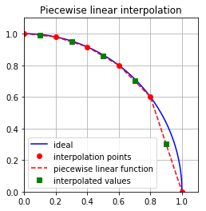


### 8.5.2 Polynomials

http://en.wikipedia.org/wiki/Taylor_series


```python
p = array([1, 3, 2])
roots(p)
```


    array([-2., -1.])


```python
p = poly([-2, -1])
p
```


    array([ 1.,  3.,  2.])


```python
p1 = poly([-2, -1])
```


```python
p2 = array([1, 0, 0, 0])
```


```python
polyadd(p1, p2)
```


    array([ 1.,  1.,  3.,  2.])


```python
p = polymul(array([1, 2]), array([1, 3]))
p
```


    array([1, 5, 6])


```python
polydiv(p, array([1, 3]))
```


    (array([ 1.,  2.]), array([ 0.]))


```python
p = poly([-1j, 1j])
```


```python
p
```


    array([ 1.,  0.,  1.])


```python
polyder(p)
polyint(p)
```


    array([ 0.33333333,  0.        ,  1.        ,  0.        ])


### 8.5.3 Uses of Polynomials

* Example: Linear Regression


```python
from pylab import *
# number of data points
N = 100
start = 0
end = 1
A = rand()+1
B = rand()
# our linear line will be y = A*x + B
x = linspace(start, end, N)
y = A*x + B
y += randn(N)/10
# linear regression
p = polyfit(x, y, 1)
figure()
title('Linear regression with polyfit()')
plot(x, y, 'o',
     label='Measured data; A=%.2f, B=%.2f' % (A, B))
plot(x, polyval(p, x), '-',
     label='Linear regression; A=%.2f, B=%.2f' % tuple(p))
legend(loc='best')
show()
```


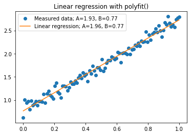


* Example: Linear Regression of Nonlinear Functions


```python
from pylab import *
# number of data points
N = 100
start = 0
end = 2
A = rand()+0.5
B = rand()
# our linear line will be:
# y = B*exp(A*x) = exp(A*x + log(B))
x = linspace(start, end, N)
y = exp(A*x+B)
y += randn(N)/5
# linear regression
p = polyfit(x, log(y), 1)
figure()
title(r'Linear regression with polyfit(), $y=Be^{Ax}$')
plot(x, y, 'o',
     label='Measured data; A=%.2f, B=%.2f' % (A, exp(B)))
plot(x, exp(polyval(p, x)), '-',
     label='Linear regression; A=%.2f, B=%.2f' % (p[0], exp(p[1])))
legend(loc='best')
show()
```


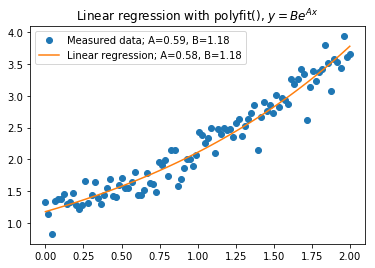


* Example: Approximating Functions with Polynomials

* Note the selection of interpolation points is an interesting topic, and work by the mathematician pafnuty Chebyshev has contributed much to the topic.
See http://en.wikipedia.org/wiki/Pafnuty_Chebyshev and http://en.wikipedia.org/wiki/Chebyshev_nodes.


```python
values = [0, pi/6, pi/4, pi/3, pi/2]
sines = sqrt(arange(5))/2
sines
```


    array([ 0.        ,  0.5       ,  0.70710678,  0.8660254 ,  1.        ])


```python
p = polyfit(values, sines, len(values)-1)
p
```


    array([  2.87971125e-02,  -2.04340696e-01,   2.13730075e-02,
             9.95626184e-01,   7.13728569e-17])


```python
# figure()
x = linspace(0, pi/2, 100)
plot(x, polyval(p, x)-sin(x), label='error', lw=3)
grid()
ylabel('polyval(p, x)-sin(x)')
xlabel('x')
title('Error approximating sin(x) using polyfit()')
xlim(0, pi/2)
show()
```


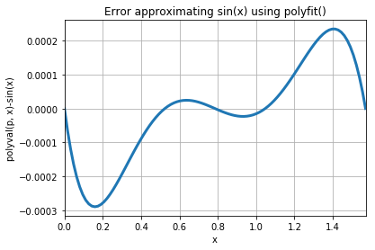


### 8.5.6 Spline Interpolation


```python
from scipy.interpolate import spline
from pylab import *
xp = linspace(0, 1, 6)
yp = sqrt(1-xp**2)
xi = linspace(0, 1, 100)
yi = interp(xi, xp, yp)
ys = spline(xp, yp, xi)
figure()
hold(True)
plot(xi, yi, '--', label='piecewise linear', lw=2)
plot(xi, ys, '-', label='spline', lw=2)
legend(loc='best')
grid()
title(r'Spline interpolation of $y=\sqrt{1-x^2}$')
xlabel('x')
ylabel('y')
axis('scaled')
axis([0, 1.2, 0, 1.2])
show()
```

    C:\Anaconda36\lib\site-packages\ipykernel\__main__.py:9: MatplotlibDeprecationWarning: pyplot.hold is deprecated.
        Future behavior will be consistent with the long-time default:
        plot commands add elements without first clearing the
        Axes and/or Figure.
    C:\Anaconda36\lib\site-packages\matplotlib\__init__.py:917: UserWarning: axes.hold is deprecated. Please remove it from your matplotlibrc and/or style files.
      warnings.warn(self.msg_depr_set % key)
    C:\Anaconda36\lib\site-packages\matplotlib\rcsetup.py:152: UserWarning: axes.hold is deprecated, will be removed in 3.0
      warnings.warn("axes.hold is deprecated, will be removed in 3.0")


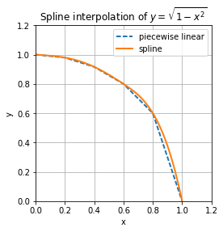


## 8.6 Solving Nonlinear Equations


```python
def f(x):
    """Returns x**2-3"""
    return x**2-3
f(10)
```


    97


```python
from scipy import optimize
```


```python
optimize.fsolve(f, 1)
```


    array([ 1.73205081])


```python
optimize.newton(f, 1)
```


    1.7320508075688772


```python
optimize.bisect(f, 1, 2)
```


    1.7320508075699763


```python
_**2
```


    3.000000000003807


## 8.7 Special Functions


```python
from scipy import special
special.chebyt(2)
```


    poly1d([  2.00000000e+00,  -2.22044605e-16,  -1.00000000e+00])


## 8.8 Signal Processing

### 8.8.1 Functions find, nonzero, where and select


```python
from pylab import *
squares = arange(10)**2
squares
```


    array([ 0,  1,  4,  9, 16, 25, 36, 49, 64, 81])


```python
I = find(squares<50)
I
```


    array([0, 1, 2, 3, 4, 5, 6, 7], dtype=int64)


```python
squares[I]
```


    array([ 0,  1,  4,  9, 16, 25, 36, 49])


```python
A = eye(3)
A
```


    array([[ 1.,  0.,  0.],
           [ 0.,  1.,  0.],
           [ 0.,  0.,  1.]])


* Example: Simple Detection of Signal in Noise, Part 1


```python
I1 = find(A!=0)
I1
```


    array([0, 4, 8], dtype=int64)


```python
A[I1]
```


    ---------------------------------------------------------------------------

    IndexError                                Traceback (most recent call last)

    <ipython-input-87-6dcd4dbcd63f> in <module>()
    ----> 1 A[I1]


    IndexError: index 4 is out of bounds for axis 0 with size 3


```python
A.ravel()[I1]
```


    array([ 1.,  1.,  1.])


```python
I2 = nonzero(A)
A[I2] = 3
A
```


    array([[ 3.,  0.,  0.],
           [ 0.,  3.,  0.],
           [ 0.,  0.,  3.]])


```python
up = arange(10)
up
```


    array([0, 1, 2, 3, 4, 5, 6, 7, 8, 9])


```python
down = arange(10, 0, -1)
down
```


    array([10,  9,  8,  7,  6,  5,  4,  3,  2,  1])


```python
highest = where(up > down, up, down)
highest
```


    array([10,  9,  8,  7,  6,  5,  6,  7,  8,  9])


```python
up = arange(10)
ramp = select([up < 4, up > 7], [4, 7], up)
ramp
```


    array([4, 4, 4, 4, 4, 5, 6, 7, 7, 7])


### 8.8.2 Listing 8-3. Randomly Placing Triangular Spikes


```python
from pylab import *
from scipy import signal
# parameters controlling the signal
n = 100
t = arange(n)
y = zeros(n)
num_pulses = 3
pw = 11
amp = 20
for i in range(num_pulses):
    loc = floor(rand()*(n-pw+1))
    y[loc:loc+pw] = signal.triang(pw)*amp
# add some noise
y += randn(n)
figure()
title('Signal and noise')
xlabel('t')
ylabel('y')
plot(t, y)
show()
```

### 8.8.3 Listing 8-4. Detecting Signals (a Continuation of Listing 8-3


```python
# detect signals
thr = amp/2
I = find(y > thr)
# plot signal with noise plus detection
figure()
hold(True)
plot(t, y, 'b', label='signal with noise')
plot(t[I], y[I], 'ro', label='detections')
plot([0, n], [thr, thr], 'g--')
# annotate the threshold
text(2, thr+.2, 'Threshold', va='bottom')
title('Simple signal detection in noise')
legend(loc='best')
show()
```

    C:\Anaconda36\lib\site-packages\ipykernel\__main__.py:6: MatplotlibDeprecationWarning: pyplot.hold is deprecated.
        Future behavior will be consistent with the long-time default:
        plot commands add elements without first clearing the
        Axes and/or Figure.
    C:\Anaconda36\lib\site-packages\matplotlib\__init__.py:917: UserWarning: axes.hold is deprecated. Please remove it from your matplotlibrc and/or style files.
      warnings.warn(self.msg_depr_set % key)
    C:\Anaconda36\lib\site-packages\matplotlib\rcsetup.py:152: UserWarning: axes.hold is deprecated, will be removed in 3.0
      warnings.warn("axes.hold is deprecated, will be removed in 3.0")


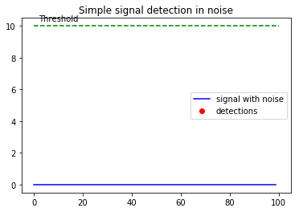


### 8.8.4 Functions diff and split


```python
v = arange(10)
split(v, [4, 8])
```


    [array([0, 1, 2, 3]), array([4, 5, 6, 7]), array([8, 9])]


* Example: Simple Detection of Signal in Noise, Part 2

### 8.8.5 Listing 8-5. Peak Detections


```python
# peak detections
J = find(diff(I) > 1)
for K in split(I, J+1):
    ytag = y[K]
    peak = find(ytag==max(ytag))
    plot(peak+K[0], ytag[peak], 'sg', ms=7)
```


```python
I = find(y > thr)
I
```


    array([], dtype=int64)


```python
diff(I)
```


    array([], dtype=int64)


```python
J = find(diff(I)>1)
J
```


    array([], dtype=int64)


```python
split(I, J+1)
```


    [array([], dtype=int64)]


### 8.8.6 Waveforms


```python
from pylab import *
from scipy import signal
cycles = 10
t = arange(0, 2*pi*cycles, pi/10)
waveforms = ['sawtooth', 'square']
# figure()
for i, waveform in enumerate(waveforms):
    subplot(2, 2, i+1)
    exec('y = signal.' + waveform + '(t)')
    plot(t, y)
    title(waveform)
    axis([0, 2*pi*cycles, -1.1, 1.1])
show()
```


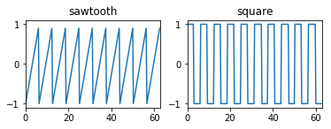


## 8.9 Fourier Transform


```python
from time import time as t
t1 = t(); dummy = sum(fft(arange(2**21))); print(t()-t1)
```

    0.3469223976135254


```python
t1 = t(); dummy = sum(fft(arange(2**21-1))); print(t()-t1)
```

    0.9615557193756104


### 8.9.1 Example: FFT of a Sampled Cosine Wave


```python
from pylab import *
from scipy import signal
N = 2**9 # we prefer powers of 2
F = 25 # a wave at 25 Hz
t = arange(N)/float(N) # sampled over 1 second
x = cos(2*pi*t*F) # the signal
figure()
p = subplot(2, 1, 1)
plot(t, x)
ylabel('x []')
xlabel('t [seconds]')
title('A cosine wave')
grid()
p = subplot(2, 1, 2)
f = t*N
xf = fft(x)
plot(f, abs(xf))
title('Fourier transform of a cosine wave')
xlabel('f [Hz]')
ylabel('xf []')
xlim([0, N])
grid()
show()
```


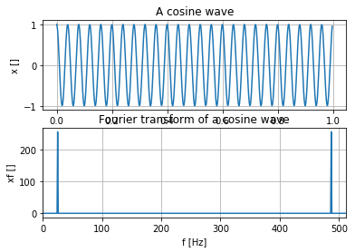


### 8.9.2 Window Functions


```python
N = 2**9 # we prefer powers of 2
F = 25.5 # wave frequency
t = arange(N)/float(N) # sampled over 1 second
f = t*N
x = cos(2*pi*t*F) # the signal
xh = x*hamming(512) # multiply with a hamming window
figure()
plot(f, abs(fft(x)), 's-', label='original')
plot(f, abs(fft(xh)), 'o-', label='with Hamming')
xlim([0, 50])
xticks(arange(0, 55, 5))
legend()
grid()
title('Signal with Hamming window')
xlabel('Frequency [Hz]')
ylabel('Amplitude []')
show()
```


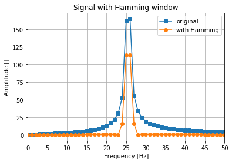


```python
from scipy import signal
help(signal)
```

## 8.10 Filtering

### 8.10.1 Filter Design

http://en.wikipedia.org/wiki/Filter_design


```python
N = 256 # number of points for freqz
Wc = 0.2 # 3dB point
Order = 3 # filter order
# design a Butterworth filter
[b, a] = signal.butter(Order, Wc)
# calculate the frequency repsonse
[w, h] = signal.freqz(b, a, N)
# plot the results
figure()
subplot(2, 1, 1)
plot(arange(N)/float(N), 20*log10(abs(h)), lw=2)
title('Frequency response')
xlabel('Frequency (normalized)')
ylabel('dB')
ylim(ylim()[0], ylim()[1]+5)
grid()
subplot(2, 1, 2)
plot(arange(N)/float(N), 20*log10(abs(h)), lw=2)
title('Frequency response (3dB point)')
xlabel('Frequency (normalized)')
ylabel('dB')
text(Wc+.02, -3, '3dB point', va='bottom')
ylim([-3, 0.1])
grid()
show()
```


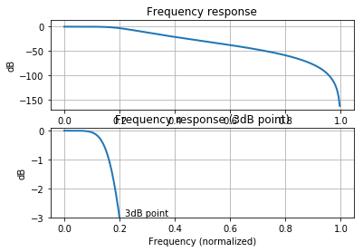


### 8.10.2 Example: A Heart-Rate Monitor


```python
# heart signal simulation
N = 256 # number of samples per second
T = 2 # number of seconds
hr = 1.67 # 100 beats per minutes
F1 = 0.5 # movement frequency
t = arange(T*N)/float(N)
y1 = 5*sin(2*pi*t*F1) # movement artifact
# add heart signals
y2 = zeros(size(y1))

for i in range(int(T*hr)):
    y2[int(i*N/hr):int(i*N/hr+10)] = signal.triang(10)

# combine movement with beats
y = y1+y2

# create a high-pass filter
[b, a] = signal.butter(3, 0.05, 'high')

# filter the signal
yn = signal.lfilter(b, a, y)

# plot the graphs
# figure()

subplot(2, 1, 1)
title('Heart signal with movement artifact (simulation)')
plot(t, y, lw=2)
xlabel('t [seconds]')
ylabel('Amplitude []')
subplot(2, 1, 2)
title('Filtered signal')
plot(t, yn, lw=2)
xlabel('t [seconds]')
ylabel('Amplitude []')
show()
```


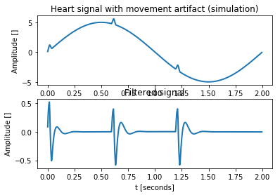


### 8.10.3 Example: Moving Average


```python
from pylab import *
N = 512
t = linspace(0, 10, N)
x = 1-exp(-t) +randn(N)/10
W = 32 # num points in moving average
xf = zeros(len(x)-W+1)
for i in range(len(x)-W+1):
    xf[i] = mean(x[i:i+W])
plot(t, x)
hold(True)
plot(t[W-1:], xf, lw=3)
title('Moving average')
legend(['signal with noise', 'filtered signal'])
xlabel('t [seconds]')
ylabel('x []')
show()
```

    C:\Anaconda36\lib\site-packages\ipykernel\__main__.py:10: MatplotlibDeprecationWarning: pyplot.hold is deprecated.
        Future behavior will be consistent with the long-time default:
        plot commands add elements without first clearing the
        Axes and/or Figure.
    C:\Anaconda36\lib\site-packages\matplotlib\__init__.py:917: UserWarning: axes.hold is deprecated. Please remove it from your matplotlibrc and/or style files.
      warnings.warn(self.msg_depr_set % key)
    C:\Anaconda36\lib\site-packages\matplotlib\rcsetup.py:152: UserWarning: axes.hold is deprecated, will be removed in 3.0
      warnings.warn("axes.hold is deprecated, will be removed in 3.0")


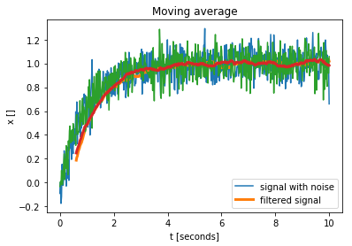


```python
from scipy import signal
xf = signal.lfilter(ones(W)/W, 1, x)
```

## 8.11 Final Notes and References

* Numerical Recipes: The Art of Scientific Computing, Third Edition by William H. Press, Saul A. Teukolsky, William T. Vetterling, and Brian P. Flannery (Cambridge University Press, 2007; for more information, see http://www.nr.com)
* SciPy, http://www.scipy.org/
