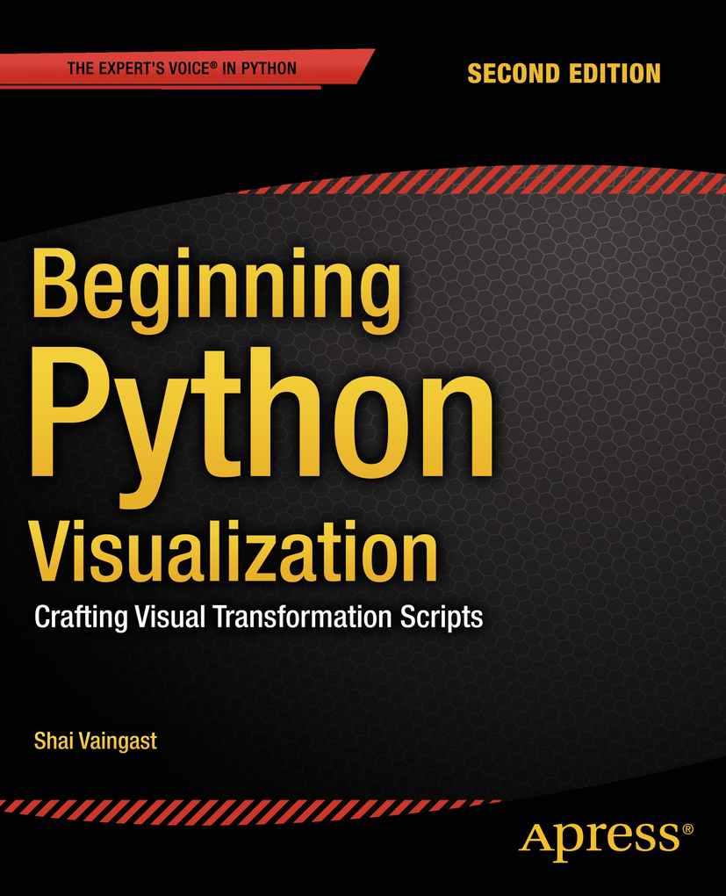

# Beginning Python Visualization

## info
* [publisher](http://www.apress.com/gp/book/9781484200537?wt_mc=ThirdParty.SpringerLink.3.EPR653.About_eBook)  
* [github](https://github.com/apress/beg-python-visualization-2ed)  

## toc
* [Chapter 1: Navigating the World of Data Visualization](Ch01_Navigating_the_World_of_Data_Visualization.md)
* [Chapter 2: The Environment](Ch02_The_Environment.md)
* [Chapter 3: Python for Programmers](Ch03_Python_for_Programmers.md)
* [Chapter 4: Data Organization](Ch04_Data_Organization.md)
* [Chapter 5: Processing Text Files](Ch05_Processing_Text_Files.md)
* [Chapter 6: Graphs and Plots](Ch06_Graphs_and_Plots.md)
* [Chapter 7: Math Games](Ch07_Math_Games.md)
* [Chapter 8: Science and Visualization](Ch08_Science_and_Visualization.md)
* [Chapter 9: Image Processing](Ch09_Image_Processing.md)
* [Chapter 10: Advanced File Processing](Ch10_Advanced_File_Processing.md)
* [Appendix: Additional Source Listing](App_Additional_Source_Listing.md)