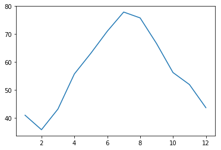
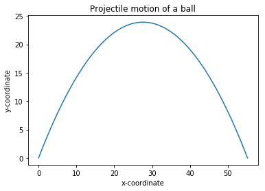

# Chapter 2: Visualizing Data with Graphs

<!-- toc orderedList:0 depthFrom:1 depthTo:6 -->

* [Chapter 2: Visualizing Data with Graphs](#chapter-2-visualizing-data-with-graphs)
  * [2.1 Understanding the Cartesian Coordinate Plane](#21-understanding-the-cartesian-coordinate-plane)
  * [2.2 Working with Lists and Tuples](#22-working-with-lists-and-tuples)
    * [Iterating over a List or Tuple](#iterating-over-a-list-or-tuple)
  * [2.3 Creating Graphs with Matplotlib](#23-creating-graphs-with-matplotlib)
    * [Marking Points on Your Graph](#marking-points-on-your-graph)
    * [Graphing the Average Annual Temperature in New York City](#graphing-the-average-annual-temperature-in-new-york-city)
    * [Comparing the Monthly Temperature Trends of New York City](#comparing-the-monthly-temperature-trends-of-new-york-city)
    * [Customizing Graphs](#customizing-graphs)
    * [Saving the Plots](#saving-the-plots)
  * [2.4 Plotting with Formulas](#24-plotting-with-formulas)
    * [Newton’s Law of Universal Gravitation](#newtons-law-of-universal-gravitation)
    * [Projectile Motion](#projectile-motion)
  * [2.5 What You Learned](#25-what-you-learned)
  * [Programming Challenges](#programming-challenges)
    * [Challenge 1: How Does the Temperature Vary During the Day](#challenge-1-how-does-the-temperature-vary-during-the-day)
    * [Challenge 2: Exploring a Quadratic Function Visually](#challenge-2-exploring-a-quadratic-function-visually)
    * [Challenge 3: Enhanced Projectile Trajectory Comparison Program](#challenge-3-enhanced-projectile-trajectory-comparison-program)
    * [Challenge 4: Visualizing Your Expenses](#challenge-4-visualizing-your-expenses)
    * [Challenge 5: Exploring the Relationship Between the Fibonacci Sequence and the Golden Ratio](#challenge-5-exploring-the-relationship-between-the-fibonacci-sequence-and-the-golden-ratio)

<!-- tocstop -->


## 2.1 Understanding the Cartesian Coordinate Plane

## 2.2 Working with Lists and Tuples


```python
simplelist = [1, 2, 3]
```


```python
simplelist[0]
```


    1


```python
simplelist[1]
```


    2


```python
simplelist[2]
```


    3


```python
stringlist = ['a string','b string','c string']
```


```python
stringlist[0]
```


    'a string'


```python
stringlist[1]
```


    'b string'


```python
stringlist[2]
```


    'c string'


### Iterating over a List or Tuple

## 2.3 Creating Graphs with Matplotlib


```python
x_numbers = [1, 2, 3]
y_numbers = [2, 4, 6]
```


```python
%pylab inline
from pylab import plot, show
plot(x_numbers, y_numbers)
```

    Populating the interactive namespace from numpy and matplotlib


    [<matplotlib.lines.Line2D at 0xa722744f60>]


### Marking Points on Your Graph


```python
plot(x_numbers, y_numbers, marker='o')
```


    [<matplotlib.lines.Line2D at 0xa72281b320>]


```python
plot(x_numbers, y_numbers, 'o')
```


    [<matplotlib.lines.Line2D at 0xa7228ba400>]


### Graphing the Average Annual Temperature in New York City


```python
nyc_temp = [53.9, 56.3, 56.4, 53.4, 54.5, 55.8, 56.8, 55.0, 55.3, 54.0, 56.7, 56.4, 57.3]
plot(nyc_temp, marker='o')
```


    [<matplotlib.lines.Line2D at 0xa72294ee10>]


```python
nyc_temp = [53.9, 56.3, 56.4, 53.4, 54.5, 55.8, 56.8, 55.0, 55.3, 54.0, 56.7, 56.4, 57.3]
years = range(2000, 2013)
plot(years, nyc_temp, marker='o')
```


    [<matplotlib.lines.Line2D at 0xa7229dbf60>]


### Comparing the Monthly Temperature Trends of New York City


```python
nyc_temp_2000 = [31.3, 37.3, 47.2, 51.0, 63.5, 71.3, 72.3, 72.7, 66.0, 57.0, 45.3, 31.1]
nyc_temp_2006 = [40.9, 35.7, 43.1, 55.7, 63.1, 71.0, 77.9, 75.8, 66.6, 56.2, 51.9, 43.6]
nyc_temp_2012 = [37.3, 40.9, 50.9, 54.8, 65.1, 71.0, 78.8, 76.7, 68.8, 58.0, 43.9, 41.5]
```


```python
months = range(1, 13)
plot(months, nyc_temp_2000, months, nyc_temp_2006, months, nyc_temp_2012)
```


    [<matplotlib.lines.Line2D at 0xa722a72160>,
     <matplotlib.lines.Line2D at 0xa722a72320>,
     <matplotlib.lines.Line2D at 0xa722a72cc0>]


```python
plot(months, nyc_temp_2000)
```


    [<matplotlib.lines.Line2D at 0xa722afccf8>]


```python
plot(months, nyc_temp_2006)
```


    [<matplotlib.lines.Line2D at 0xa722b852e8>]





```python
plot(months, nyc_temp_2012)
```


    [<matplotlib.lines.Line2D at 0xa722c097b8>]


```python
plot(months, nyc_temp_2000, months, nyc_temp_2006, months, nyc_temp_2012)
```


    [<matplotlib.lines.Line2D at 0xa722d9f6a0>,
     <matplotlib.lines.Line2D at 0xa722d9f860>,
     <matplotlib.lines.Line2D at 0xa722da7240>]


```python
from pylab import legend
legend([2000, 2006, 2012])
```


    <matplotlib.legend.Legend at 0xa722e314e0>


```python
show()
```

### Customizing Graphs


```python
from pylab import plot, show, title, xlabel, ylabel, legend
plot(months, nyc_temp_2000, months, nyc_temp_2006, months, nyc_temp_2012)
title('Average monthly temperature in NYC')
xlabel('Month')
ylabel('Temperature')
legend([2000, 2006, 2012])
```


    <matplotlib.legend.Legend at 0xa722eb8208>


```python
nyc_temp = [53.9, 56.3, 56.4, 53.4, 54.5, 55.8, 56.8, 55.0, 55.3, 54.0, 56.7, 56.4, 57.3]
plot(nyc_temp, marker='o')
```


    [<matplotlib.lines.Line2D at 0xa723f2a208>]


```python
nyc_temp = [53.9, 56.3, 56.4, 53.4, 54.5, 55.8, 56.8, 55.0, 55.3, 54.0, 56.7, 56.4, 57.3]
plot(nyc_temp, marker='o')

from pylab import axis
axis()

axis(ymin=0)
```


    (-0.60000000000000009, 12.6, 0, 57.494999999999997)


```python
'''
Simple plot using pyplot
'''
import matplotlib.pyplot
def create_graph():
    x_numbers = [1, 2, 3]
    y_numbers = [2, 4, 6]
    matplotlib.pyplot.plot(x_numbers, y_numbers)
    matplotlib.pyplot.show()

if __name__ == '__main__':
    create_graph()
```


```python
'''
Simple plot using pyplot
'''
import matplotlib.pyplot as plt
def create_graph():
    x_numbers = [1, 2, 3]
    y_numbers = [2, 4, 6]
    plt.plot(x_numbers, y_numbers)
    plt.show()

if __name__ == '__main__':
    create_graph()
```


### Saving the Plots


```python
from pylab import plot, savefig
x = [1, 2, 3]
y = [2, 4, 6]
plot(x, y)
savefig('mygraph.png')
```


```python
savefig('./images/mygraph.png')
```


    <matplotlib.figure.Figure at 0xa7242e50f0>


## 2.4 Plotting with Formulas

### Newton’s Law of Universal Gravitation


```python
'''
The relationship between gravitational force and
distance between two bodies
'''
import matplotlib.pyplot as plt
# Draw the graph

def draw_graph(x, y):
    plt.plot(x, y, marker='o')
    plt.xlabel('Distance in meters')
    plt.ylabel('Gravitational force in newtons')
    plt.title('Gravitational force and distance')
    plt.show()

def generate_F_r():
    # Generate values for r
    r = range(100, 1001, 50)
    # Empty list to store the calculated values of F
    F = []
    # Constant, G
    G = 6.674*(10**-11)
    # Two masses
    m1 = 0.5
    m2 = 1.5

    # Calculate force and add it to the list, F
    for dist in r:
        force = G*(m1*m2)/(dist**2)
        F.append(force)

    # Call the draw_graph function
    draw_graph(r, F)

if __name__=='__main__':
    generate_F_r()
```


### Projectile Motion


```python
'''
Generate equally spaced floating point
numbers between two given values
'''
def frange(start, final, increment):
    numbers = []
    while start < final:
        numbers.append(start)
        start = start + increment
    return numbers
```


```python
'''
Draw the trajectory of a body in projectile motion
'''
from matplotlib import pyplot as plt
import math

def draw_graph(x, y):
    plt.plot(x, y)
    plt.xlabel('x-coordinate')
    plt.ylabel('y-coordinate')
    plt.title('Projectile motion of a ball')

def frange(start, final, interval):
    numbers = []
    while start < final:
        numbers.append(start)
        start = start + interval
    return numbers

def draw_trajectory(u, theta):
    theta = math.radians(theta)
    g = 9.8
    # Time of flight
    t_flight = 2*u*math.sin(theta)/g
    # Find time intervals
    intervals = frange(0, t_flight, 0.001)
    # List of x and y coordinates
    x = []
    y = []
    for t in intervals:
        x.append(u*math.cos(theta)*t)
        y.append(u*math.sin(theta)*t - 0.5*g*t*t)
    draw_graph(x, y)

if __name__ == '__main__':
    try:
        u = float(input('Enter the initial velocity (m/s): '))
        theta = float(input('Enter the angle of projection (degrees): '))
    except ValueError:
        print('You entered an invalid input')
    else:
        draw_trajectory(u, theta)
        plt.show()
```

    Enter the initial velocity (m/s): 25
    Enter the angle of projection (degrees): 60





```python
if __name__ == '__main__':
    # List of three different initial velocities
    u_list = [20, 40, 60]
    theta = 45
    for u in u_list:
        draw_trajectory(u, theta)

    # Add a legend and show the graph
    plt.legend(['20', '40', '60'])
    plt.show()
```


## 2.5 What You Learned

## Programming Challenges

### Challenge 1: How Does the Temperature Vary During the Day


```python

```

### Challenge 2: Exploring a Quadratic Function Visually


```python
'''
Quadratic function calculator
'''
# Assume values of x
x_values = [-1, 1, 2, 3, 4, 5]
for x in x_values:
    # Calculate the value of the quadratic function
    y = x**2 + 2*x + 1
    print('x={0} y={1}'.format(x, y))
```

    x=-1 y=0
    x=1 y=4
    x=2 y=9
    x=3 y=16
    x=4 y=25
    x=5 y=36


### Challenge 3: Enhanced Projectile Trajectory Comparison Program


```python

```

### Challenge 4: Visualizing Your Expenses


```python
'''
Example of drawing a horizontal bar chart
'''
import matplotlib.pyplot as plt
def create_bar_chart(data, labels):
    # Number of bars
    num_bars = len(data)
    # This list is the point on the y-axis where each
    # Bar is centered. Here it will be [1, 2, 3...]
    positions = range(1, num_bars+1)
    plt.barh(positions, data, align='center')
    # Set the label of each bar
    plt.yticks(positions, labels)
    plt.xlabel('Steps')
    plt.ylabel('Day')
    plt.title('Number of steps walked')
    # Turns on the grid which may assist in visual estimation
    plt.grid()
    plt.show()

if __name__ == '__main__':
    # Number of steps I walked during the past week
    steps = [6534, 7000, 8900, 10786, 3467, 11045, 5095]
    # Corresponding days
    labels = ['Sun', 'Mon', 'Tue', 'Wed', 'Thu', 'Fri', 'Sat']
    create_bar_chart(steps, labels)
```


### Challenge 5: Exploring the Relationship Between the Fibonacci Sequence and the Golden Ratio


```python
def fibo(n):
    if n == 1:
        return [1]
    if n == 2:
        return [1, 1]
    # n > 2
    a = 1
    b = 1
    # First two members of the series
    series = [a, b]

    for i in range(n):
        c = a + b
        series.append(c)
        a = b
        b = c
    return series
```


```python

```
