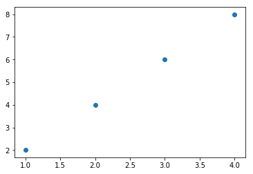
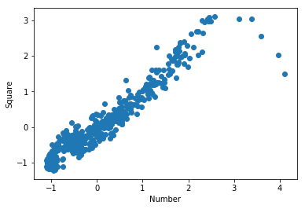

# Chapter 3: Describing Data with Statistics

<div id="toc"></div>

## 3.1 Finding the Mean


```python
shortlist = [1, 2, 3]
sum(shortlist)
```


    6


```python
len(shortlist)
```


    3


```python
#P62: Calculating the mean
'''
Calculating the mean
'''
def calculate_mean(numbers):
    s = sum(numbers)
    N = len(numbers)
    # calculate the mean
    mean = s/N
    return mean
if __name__ == '__main__':
    donations = [100, 60, 70, 900, 100, 200, 500, 500, 503, 600, 1000, 1200]
    mean = calculate_mean(donations)
    N = len(donations)
    print('Mean donation over the last {0} days is {1}'.format(N, mean))
```

    Mean donation over the last 12 days is 477.75
    

## 3.2 Finding the Median


```python
samplelist = [4, 1, 3]
samplelist.sort()
samplelist
```


    [1, 3, 4]


```python
#P63: Calculating the median
'''
Calculating the median
'''
def calculate_median(numbers):
    N = len(numbers)
    numbers.sort()

    # find the median
    if N % 2 == 0:
        # if N is even
        m1 = N/2
        m2 = (N/2) + 1
        # convert to integer, match position
        m1 = int(m1) - 1
        m2 = int(m2) - 1
        median = (numbers[m1] + numbers[m2])/2
    else:
        m = (N+1)/2
        # convert to integer, match position
        m = int(m) - 1
        median = numbers[m]
    return median

if __name__ == '__main__':
    donations = [100, 60, 70, 900, 100, 200, 500, 500, 503, 600, 1000, 1200]
    median = calculate_median(donations)
    N = len(donations)
    print('Median donation over the last {0} days is {1}'.format(N, median))

```

    Median donation over the last 12 days is 500.0
    

## 3.3 Finding the Mode and Creating a Frequency Table

### Finding the Most Common Elements


```python
simplelist = [4, 2, 1, 3, 4]
from collections import Counter
c = Counter(simplelist)
c.most_common()
```


    [(4, 2), (2, 1), (1, 1), (3, 1)]


```python
c.most_common(1)
```


    [(4, 2)]


```python
c.most_common(2)
```


    [(4, 2), (2, 1)]


```python
mode = c.most_common(1)
mode
```


    [(4, 2)]


```python
mode[0]
```


    (4, 2)


```python
mode[0][0]
```


    4


### Finding the Mode


```python
#P67: Calculating the mode
'''
Calculating the mode
'''
from collections import Counter
def calculate_mode(numbers):
    c = Counter(numbers)
    mode = c.most_common(1)
    return mode[0][0]

if __name__=='__main__':
    scores = [7,8,9,2,10,9,9,9,9,4,5,6,1,5,6,7,8,6,1,10]
    mode = calculate_mode(scores)
    print('The mode of the list of numbers is: {0}'.format(mode))
```

    The mode of the list of numbers is: 9
    


```python
#P68: 

'''
Calculating the mode when the list of numbers may have multiple modes
'''
from collections import Counter
def calculate_mode(numbers):
    c = Counter(numbers)
    numbers_freq = c.most_common()
    max_count = numbers_freq[0][1]
    modes = []
    for num in numbers_freq:
        if num[1] == max_count:
            modes.append(num[0])
    return modes
if __name__ == '__main__':
    scores = [5, 5, 5, 4, 4, 4, 9, 1, 3]
    modes = calculate_mode(scores)
    print('The mode(s) of the list of numbers are:')
    for mode in modes:
        print(mode)
```

    The mode(s) of the list of numbers are:
    5
    4
    

### Creating a Frequency Table


```python
#P69: Frequency table
'''
Frequency table for a list of numbers
'''
from collections import Counter
def frequency_table(numbers):
    table = Counter(numbers)
    print('Number\tFrequency')
    for number in table.most_common():
        print('{0}\t{1}'.format(number[0], number[1]))

if __name__=='__main__':
    scores = [7, 8, 9, 2, 10, 9, 9, 9, 9, 4, 5, 6, 1, 5, 6, 7, 8, 6, 1, 10]
    frequency_table(scores)

```

    Number	Frequency
    9	5
    6	3
    7	2
    8	2
    10	2
    5	2
    1	2
    2	1
    4	1
    


```python
#P70: Frequency table with the numbers sorted

'''
Frequency table for a list of numbers
Enhanced to display the table sorted by the numbers
'''
from collections import Counter
def frequency_table(numbers):
    table = Counter(numbers)
    numbers_freq = table.most_common()
    numbers_freq.sort()

    print('Number\tFrequency')
    for number in numbers_freq:
        print('{0}\t{1}'.format(number[0], number[1]))

if __name__ == '__main__':
    scores = [7,8,9,2,10,9,9,9,9,4,5,6,1,5,6,7,8,6,1,10]
    frequency_table(scores)
```

    Number	Frequency
    1	2
    2	1
    4	1
    5	2
    6	3
    7	2
    8	2
    9	5
    10	2
    

## 3.4 Measuring the Dispersion

### Finding the Range of a Set of Numbers


```python
#P72

'''
Find the range
'''
def find_range(numbers):
    lowest = min(numbers)
    highest = max(numbers)
    # find the range
    r = highest-lowest
    return lowest, highest, r
if __name__ == '__main__':
    donations = [100, 60, 70, 900, 100, 200, 500, 500, 503, 600, 1000, 1200]
    lowest, highest, r = find_range(donations)
    print('Lowest: {0} Highest: {1} Range: {2}'.format(lowest, highest, r))

```

    Lowest: 60 Highest: 1200 Range: 1140
    


```python
'''
Find the range using a dictionary to return values, Appendix B
'''
def find_range(numbers):
    lowest = min(numbers)
    highest = max(numbers)
    # find the range
    r = highest-lowest
    return {'lowest':lowest, 'highest':highest, 'range':r}
if __name__ == '__main__':
    donations = [100, 60, 70, 900, 100, 200, 500, 500, 503, 600, 1000, 1200]
    result = find_range(donations)
    print('Lowest: {0} Highest: {1} Range: {2}'.
          format(result['lowest'], result['highest'], result['range']))
```

    Lowest: 60 Highest: 1200 Range: 1140
    

### Finding the Variance and Standard Deviation


```python
#P73: Find the variance and standard deviation

'''
Find the variance and standard deviation of a list of numbers
'''
def calculate_mean(numbers):
    s = sum(numbers)
    N = len(numbers)
    # calculate the mean
    mean = s/N
    return mean

def find_differences(numbers):
    # find the mean
    mean = calculate_mean(numbers)
    # find the differences from the mean
    diff = []
    
    for num in numbers:
        diff.append(num-mean)
    return diff
def calculate_variance(numbers):
    # find the list of differences
    diff = find_differences(numbers)
    # find the squared differences
    squared_diff = []
    for d in diff:
        squared_diff.append(d**2)
    #find the variance
    sum_squared_diff = sum(squared_diff)
    variance = sum_squared_diff/len(numbers)
    return variance

if __name__ == '__main__':
    donations = [100, 60, 70, 900, 100, 200, 500, 500, 503, 600, 1000, 1200]
    variance = calculate_variance(donations)
    print('The variance of the list of numbers is {0}'.format(variance))
    std = variance**0.5
    print('The standard deviation of the list of numbers is {0}'.format(std))

```

    The variance of the list of numbers is 141047.35416666666
    The standard deviation of the list of numbers is 375.5627166887931
    

## 3.5 Calculating the Correlation Between Two Data Sets

### Calculating the Correlation Coefficient


```python
#P77: How the zip() function works
simple_list1 = [1, 2, 3]
simple_list2 = [4, 5, 6]
for x,y in zip(simple_list1, simple_list2):
    print(x, y)
```

    1 4
    2 5
    3 6
    


```python
#P77: Function to calculate the linear correlation
def find_corr_x_y(x,y):    
    n = len(x)
    # find the sum of the products
    prod = []
    for xi,yi in zip(x,y):
        prod.append(xi*yi)
    sum_prod_x_y = sum(prod)
    sum_x = sum(x)
    sum_y = sum(y)
    squared_sum_x = sum_x**2
    squared_sum_y = sum_y**2
    x_square = []
    for xi in x:
        x_square.append(xi**2)
    # find the sum
    x_square_sum = sum(x_square)
    y_square=[]
    for yi in y:
        y_square.append(yi**2)
    # find the sum
    y_square_sum = sum(y_square)
    
    # use formula to calculate correlation
    numerator = n*sum_prod_x_y - sum_x*sum_y
    denominator_term1 = n*x_square_sum - squared_sum_x
    denominator_term2 = n*y_square_sum - squared_sum_y
    denominator = (denominator_term1*denominator_term2)**0.5
    correlation = numerator/denominator
    
    return correlation


```

### High School Grades and Performance on College Admission Tests


```python
#P79/80: Correlation

# Find the correlation for high school grades and college admission scores
if __name__=='__main__':
    high_school_math = [90, 92, 95, 96, 87, 87, 90, 95, 98, 96]
    college_admission = [85, 87, 86, 97, 96, 88, 89, 98, 98, 87]
    corr = find_corr_x_y(high_school_math, college_admission)
    print('Correlation coefficient: {0}'.format(corr))
```

    Correlation coefficient: 0.3183785775683751
    


```python
#P79/80: Correlation

# Find the correlation for high school math grades and college admission scores
if __name__=='__main__':
    high_school_math = [83, 85, 84, 96, 94, 86, 87, 97, 97, 85]
    college_admission = [85, 87, 86, 97, 96, 88, 89, 98, 98, 87]
    corr = find_corr_x_y(high_school_math, college_admission)
    print('Correlation coefficient: {0}'.format(corr))
```

    Correlation coefficient: 0.9989633063220916
    

## 3.6 Scatter Plots


```python
# P81: Example of creating a scatter plot
x = [1, 2, 3, 4]
y = [2, 4, 6, 8]
import matplotlib.pyplot as plt
plt.scatter(x, y)
plt.show()
```





## 3.7 Reading Data from Files

### Reading Data from a Text File


```python
#P84: Sum of the numbers read from a file

# Find the sum of numbers stored in a file
def sum_data(filename):
    s = 0
    with open(filename) as f:
        for line in f:
            s = s + float(line)
    print('Sum of the numbers: {0}'.format(s))

if __name__ == '__main__':
    sum_data('data/mydata.txt')

```

    Sum of the numbers: 5733.0
    


```python
#P85: Calculate the mean of numbers stored in a file

'''
Calculating the mean of numbers stored in a file
'''
def read_data(filename):
    numbers = []
    with open(filename) as f:
        for line in f:
            numbers.append(float(line))
    return numbers

def calculate_mean(numbers):
    s = sum(numbers)
    N = len(numbers)
    mean = s/N
    
    return mean

if __name__ == '__main__':
    data = read_data('data/mydata.txt')
    mean = calculate_mean(data)
    print('Mean: {0}'.format(mean))
```

    Mean: 477.75
    

### Reading Data from a CSV File


```python
#P86: Read a CSV file and create a scatter plot

import csv
import matplotlib.pyplot as plt

def scatter_plot(x, y):
    plt.scatter(x, y)
    plt.xlabel('Number')
    plt.ylabel('Square')
    plt.show()
    
def read_csv(filename):
    numbers = []
    squared = []
    with open(filename) as f:
        reader = csv.reader(f)
        next(reader)
        for row in reader:
            numbers.append(int(row[0]))
            squared.append(int(row[1]))
    return numbers, squared

if __name__ == '__main__':
    numbers, squared = read_csv('data/numbers.csv')
    scatter_plot(numbers, squared)
```


```python
#P86/88: Calculate correlation and create a scatter plot similar to that 
# on Google correlate
import matplotlib.pyplot as plt
import csv

def read_csv(filename):
    with open(filename) as f:
        reader = csv.reader(f)
        next(reader)
        summer = []
        highest_correlated = []
        for row in reader:
            summer.append(float(row[1]))
            highest_correlated.append(float(row[2]))
    return summer, highest_correlated

if __name__ == '__main__':
    summer, highest_correlated = read_csv('data/correlate-summer.csv')
    corr = find_corr_x_y(summer, highest_correlated)
    print('Highest correlation: {0}'.format(corr))
    scatter_plot(summer, highest_correlated)
```

    Highest correlation: 0.9605138954331739
    





## 3.8 What You Learned

## 3.9 Programming Challenges

### Challenge 1: Better Correlation Coefficient–Finding Program

### Challenge 2: Statistics Calculator 

### Challenge 3: Experiment with Other CSV Data

### Challenge 4: Finding the Percentile

### Challenge 5: Creating a Grouped Frequency Table


```python
#P91: Create classes for grouped frequency table
def create_classes(numbers, n):
    low = min(numbers)
    high = max(numbers)
    # Width of each class
    width = (high - low)/n
    classes = []
    a = low
    b = low + width
    classes = []
    while a < (high-width):
        classes.append((a, b)) 
        a= b
        b = a + width
    # The last class may be of a size that is less than width
    classes.append((a, high+1))
    return classes

create_classes([7, 8, 9, 2, 10, 9, 9, 9, 9, 4, 5, 6, 1, 5, 6, 7, 8, 6, 1, 10], 4)
```


    [(1, 3.25), (3.25, 5.5), (5.5, 7.75), (7.75, 11)]


```python

```
