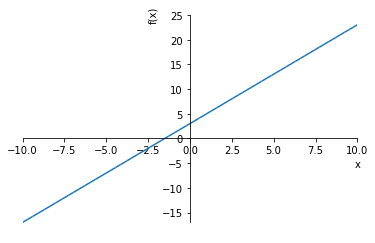
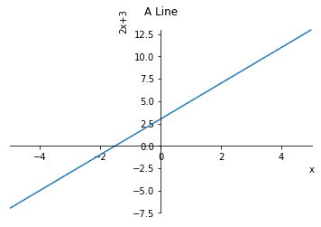
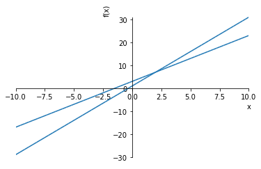
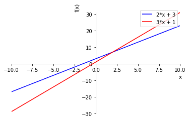

# Chapter 4: Algebra and Symbolic Math with SymPy
<!-- toc orderedList:0 depthFrom:1 depthTo:6 -->

* [Chapter 4: Algebra and Symbolic Math with SymPy](#chapter-4-algebra-and-symbolic-math-with-sympy)
  * [4.1 Defining Symbols and Symbolic Operations](#41-defining-symbols-and-symbolic-operations)
  * [4.2 Working with Expressions](#42-working-with-expressions)
    * [Factorizing and Expanding Expressions](#factorizing-and-expanding-expressions)
    * [Pretty Printing](#pretty-printing)
    * [Substituting in Values](#substituting-in-values)
    * [Converting Strings to Mathematical Expressions](#converting-strings-to-mathematical-expressions)
  * [4.3 Solving Equations](#43-solving-equations)
    * [Solving Quadratic Equations](#solving-quadratic-equations)
    * [Solving for One Variable in Terms of Others](#solving-for-one-variable-in-terms-of-others)
    * [Solving a System of Linear Equations](#solving-a-system-of-linear-equations)
  * [4.4 Plotting Using SymPy](#44-plotting-using-sympy)
    * [Plotting Expressions Input by the User](#plotting-expressions-input-by-the-user)
    * [Plotting Multiple Functions](#plotting-multiple-functions)
  * [4.5 What You Learned](#45-what-you-learned)
  * [4.6 Programming Challenges](#46-programming-challenges)
    * [Challenge 1: Factor Finder](#challenge-1-factor-finder)
    * [Challenge 2: Graphical Equation Solver](#challenge-2-graphical-equation-solver)
    * [Challenge 3: Summing a Series](#challenge-3-summing-a-series)
    * [Challenge 4: Solving Single-Variable Inequalities](#challenge-4-solving-single-variable-inequalities)
    * [Hints: Handy Functions](#hints-handy-functions)

<!-- tocstop -->


## 4.1 Defining Symbols and Symbolic Operations

## 4.2 Working with Expressions

### Factorizing and Expanding Expressions


```python
#P96/97: Basic factorization and expansion
from sympy import Symbol, factor, expand
x = Symbol('x')
y = Symbol('y')
expr = x**2 - y**2
f = factor(expr)
print(f)
# Expand
print(expand(f))
```

    (x - y)*(x + y)
    x**2 - y**2


```python
#P97: Factorizing and expanding a complicated identity
from sympy import Symbol, factor, expand
x = Symbol('x')
y = Symbol('y')
expr = x**3 + 3*x**2*y + 3*x*y**2 + y**3

print('Original expression: {0}'.format(expr))
factors = factor(expr)
print('Factors: {0}'.format(factors))


expanded = expand(factors)
print('Expansion: {0}'.format(expanded))

```

    Original expression: x**3 + 3*x**2*y + 3*x*y**2 + y**3
    Factors: (x + y)**3
    Expansion: x**3 + 3*x**2*y + 3*x*y**2 + y**3


### Pretty Printing


```python
#P97: Pretty printing
from sympy import Symbol, pprint, init_printing
x = Symbol('x')
expr = x*x + 2*x*y + y*y
pprint(expr)
# Reverse order lexicographical
init_printing(order='rev-lex')
expr = 1 + 2*x + 2*x**2
pprint(expr)
```

     2            2
    x  + 2⋅x⋅y + y
                 2
    1 + 2⋅x + 2⋅x


```python
#P99: Print a series

'''
Print the series:
x + x**2 + x**3 + ... + x**n
    ____  _____         ____
      2     3             n
'''
from sympy import Symbol, pprint, init_printing
def print_series(n):
    # initialize printing system with
    # reverse order
    init_printing(order='rev-lex')
    x = Symbol('x')
    series = x
    for i in range(2, n+1):
        series = series + (x**i)/i
    pprint(series)

if __name__ == '__main__':
    n = input('Enter the number of terms you want in the series: ')
    print_series(int(n))
```

    Enter the number of terms you want in the series: 10
         2    3    4    5    6    7    8    9    10
        x    x    x    x    x    x    x    x    x
    x + ── + ── + ── + ── + ── + ── + ── + ── + ───
        2    3    4    5    6    7    8    9     10


### Substituting in Values


```python
#P100: Substituting in values
from sympy import Symbol
x = Symbol('x')
y = Symbol('y')
expr = x*x + x*y + x*y + y*y
res = expr.subs({x:1, y:2})
res
```


$$9$$


```python
#P102: Print a series and also calculate its value at a certain point

'''
Print the series:

x + x**2 + x**3 + ... + x**n
    ____  _____         ____
      2     3             n

and calculate its value at a certain value of x.
'''

from sympy import Symbol, pprint, init_printing
def print_series(n, x_value):
    # initialize printing system with
    # reverse order
    init_printing(order='rev-lex')
    x = Symbol('x')
    series = x
    for i in range(2, n+1):
        series = series + (x**i)/i
    pprint(series)
    # evaluate the series at x_value
    series_value = series.subs({x:x_value})
    print('Value of the series at {0}: {1}'.format(x_value, series_value))

if __name__ == '__main__':
    n = input('Enter the number of terms you want in the series: ')
    x_value = input('Enter the value of x at which you want to evaluate the series: ')
    print_series(int(n), float(x_value))
```

    Enter the number of terms you want in the series: 10
    Enter the value of x at which you want to evaluate the series: 10
         2    3    4    5    6    7    8    9    10
        x    x    x    x    x    x    x    x    x
    x + ── + ── + ── + ── + ── + ── + ── + ── + ───
        2    3    4    5    6    7    8    9     10
    Value of the series at 10.0: 1125229242.53968


### Converting Strings to Mathematical Expressions


```python
# P104: Expression multiplier

'''
Product of two expressions
'''

from sympy import expand, sympify
from sympy.core.sympify import SympifyError
def product(expr1, expr2):
    prod = expand(expr1*expr2)
    print(prod)

if __name__=='__main__':
    expr1 = input('Enter the first expression: ')
    expr2 = input('Enter the second expression: ')
    try:
        expr1 = sympify(expr1)
        expr2 = sympify(expr2)
    except SympifyError:
        print('Invalid input')
    else:
        product(expr1, expr2)

```

    Enter the first expression: 10
    Enter the second expression: 5
    50


## 4.3 Solving Equations


```python
#P105: Solving a linear equation
from sympy import Symbol, solve
x = Symbol('x')
expr = x - 5 - 7
solve(expr)
```


$$\left [ 12\right ]$$


### Solving Quadratic Equations


```python
#P106: Solving a quadratic equation
from sympy import solve
x = Symbol('x')
expr = x**2 + 5*x + 4
solve(expr, dict=True)
```


$$\left [ \left \{ x : -4\right \}, \quad \left \{ x : -1\right \}\right ]$$


```python
#P106: Quadratic equation with imaginary roots
from sympy import Symbol
x=Symbol('x')
expr = x**2 + x + 1
solve(expr, dict=True)
```


$$\left [ \left \{ x : - \frac{\sqrt{3} i}{2} - \frac{1}{2}\right \}, \quad \left \{ x : \frac{\sqrt{3} i}{2} - \frac{1}{2}\right \}\right ]$$


### Solving for One Variable in Terms of Others


```python
#P106/107: Solving for one variable in terms of others
from sympy import Symbol, solve
x = Symbol('x')
a = Symbol('a')
b = Symbol('b')
c = Symbol('c')
expr = a*x*x + b*x + c
solve(expr, x, dict=True)
```


$$\left [ \left \{ x : \frac{1}{2 a} \left(\sqrt{b^{2} - 4 a c} - b\right)\right \}, \quad \left \{ x : - \frac{1}{2 a} \left(\sqrt{b^{2} - 4 a c} + b\right)\right \}\right ]$$


```python
#P107: Express s in terms of u, a, t
from sympy import Symbol, solve, pprint
s = Symbol('s')
u = Symbol('u')
t = Symbol('t')
a = Symbol('a')
expr = u*t + (1/2)*a*t*t - s
t_expr = solve(expr,t, dict=True)
t_expr
```


$$\left [ \left \{ t : \frac{1}{a} \left(\sqrt{u^{2} + 2.0 a s} - u\right)\right \}, \quad \left \{ t : - \frac{1}{a} \left(\sqrt{u^{2} + 2.0 a s} + u\right)\right \}\right ]$$


### Solving a System of Linear Equations


```python
#P108: Solve a system of Linear equations
from sympy import Symbol
x = Symbol('x')
y = Symbol('y')
expr1 = 2*x + 3*y - 6
expr2 = 3*x + 2*y - 12
solve((expr1, expr2), dict=True)
```


$$\left [ \left \{ x : \frac{24}{5}, \quad y : - \frac{6}{5}\right \}\right ]$$


## 4.4 Plotting Using SymPy


```python
#P109: Simple plot with SymPy
from sympy.plotting import plot
from sympy import Symbol
x = Symbol('x')
plot(2*x+3)
```





    <sympy.plotting.plot.Plot at 0x39ad0b9710>


```python
#P110: Plot in SymPy with range of x as well as other attributes specified
from sympy import plot, Symbol
x = Symbol('x')
plot(2*x + 3, (x, -5, 5), title='A Line', xlabel='x', ylabel='2x+3')
```





    <sympy.plotting.plot.Plot at 0x39b03ba898>


### Plotting Expressions Input by the User


```python
#P112: Plot the graph of an input expression
'''
Plot the graph of an input expression
'''
from sympy import Symbol, sympify, solve
from sympy.plotting import plot

def plot_expression(expr):
    y = Symbol('y')
    solutions = solve(expr, y)
    expr_y = solutions[0]
    plot(expr_y)

if __name__=='__main__':
    expr = input('Enter your expression in terms of x and y: ')
    try:
        expr = sympify(expr)
    except SympifyError:
        print('Invalid input')
    else:
        plot_expression(expr)
```

### Plotting Multiple Functions


```python
#P113: Plotting multiple functions
from sympy.plotting import plot
from sympy import Symbol
x = Symbol('x')
plot(2*x+3, 3*x+1)
```





    <sympy.plotting.plot.Plot at 0x39b03ba9e8>


```python
#P114: Plot of the two lines drawn in a different color
from sympy.plotting import plot
from sympy import Symbol
x = Symbol('x')
p = plot(2*x+3, 3*x+1, legend=True, show=False)
p[0].line_color = 'b'
p[1].line_color = 'r'
p.show()
```





## 4.5 What You Learned

## 4.6 Programming Challenges

### Challenge 1: Factor Finder

### Challenge 2: Graphical Equation Solver


```python

```

### Challenge 3: Summing a Series


```python
#P116: Example of summing a series
from sympy import Symbol, summation, pprint
x = Symbol('x')
n = Symbol('n')
s = summation(x**n/n, (n, 1, 5))
s.subs({x:1.2})
```


$$3.512064$$


### Challenge 4: Solving Single-Variable Inequalities


```python
#P117: Example of solving a polynomial inequality
from sympy import Poly, Symbol, solve_poly_inequality
x = Symbol('x')
ineq_obj = -x**2 + 4 < 0
lhs = ineq_obj.lhs
p = Poly(lhs, x)
rel = ineq_obj.rel_op
solve_poly_inequality(p, rel)
```


$$\left [ \left(-\infty, -2\right), \quad \left(2, \infty\right)\right ]$$


```python
#P118: Example of solving a rational inequality
from sympy import Symbol, Poly, solve_rational_inequalities
x = Symbol('x')
ineq_obj = ((x-1)/(x+2)) > 0
lhs = ineq_obj.lhs
numer, denom = lhs.as_numer_denom()
p1 = Poly(numer)
p2 = Poly(denom)
rel = ineq_obj.rel_op
solve_rational_inequalities([[((p1, p2), rel)]])
```


$$\left(-\infty, -2\right) \cup \left(1, \infty\right)$$


```python
#P118: Solve a non-polynomial inequality
from sympy import Symbol, solve, solve_univariate_inequality, sin
x = Symbol('x')
ineq_obj = sin(x) - 0.6 > 0
solve_univariate_inequality(ineq_obj, x, relational=False)
```


$$\left(0.643501108793284, 2.49809154479651\right)$$


### Hints: Handy Functions


```python
x = Symbol('x')
expr = x**2 - 4
expr.is_polynomial()
```


    True


```python
expr = 2*sin(x) + 3
expr.is_polynomial()
```


    False


```python
expr = (2+x)/(3+x)
expr.is_rational_function()
```


    True


```python
expr = 2+x
expr.is_rational_function()
```


    True


```python
expr = 2+sin(x)
expr.is_rational_function()
```


    False


```python
from sympy import sympify
sympify('x+3>0')
```


$$3 + x > 0$$


```python

```
