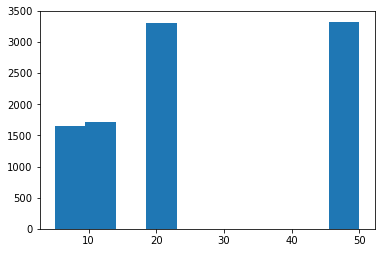

# Chapter 5: Playing with Sets and Probability
<!-- toc orderedList:0 depthFrom:1 depthTo:6 -->

* [Chapter 5: Playing with Sets and Probability](#chapter-5-playing-with-sets-and-probability)
  * [5.1 What’s a Set](#51-whats-a-set)
    * [Set Construction](#set-construction)
    * [Subsets, Supersets, and Power Sets](#subsets-supersets-and-power-sets)
    * [Set Operations](#set-operations)
  * [5.2 Probability](#52-probability)
    * [Probability of Event A or Event B](#probability-of-event-a-or-event-b)
    * [Probability of Event A and Event B](#probability-of-event-a-and-event-b)
    * [Generating Random Numbers](#generating-random-numbers)
    * [Nonuniform Random Numbers](#nonuniform-random-numbers)
  * [5.3 What You Learned](#53-what-you-learned)
  * [5.4 Programming Challenges](#54-programming-challenges)
    * [Challenge 1: Using Venn Diagrams to Visualize Relationships  Between Sets](#challenge-1-using-venn-diagrams-to-visualize-relationships-between-sets)
    * [Challenge 2: Law of Large Numbers](#challenge-2-law-of-large-numbers)
    * [Challenge 3: How Many Tosses Before You Run Out of Money](#challenge-3-how-many-tosses-before-you-run-out-of-money)
    * [Challenge 4: Shuffling a Deck of Cards](#challenge-4-shuffling-a-deck-of-cards)
    * [Challenge 5: Estimating the Area of a Circle](#challenge-5-estimating-the-area-of-a-circle)

<!-- tocstop -->


## 5.1 What’s a Set

### Set Construction


```python
from sympy import FiniteSet
s = FiniteSet(2, 4, 6)
s
```


    {2, 4, 6}


```python
from sympy import FiniteSet
from fractions import Fraction
s = FiniteSet(1, 1.5, Fraction(1, 5))
s
```


    {1/5, 1, 1.5}


```python
s = FiniteSet(1, 1.5, 3)
len(s)
```


    3


```python
4 in s
```


    False


### Subsets, Supersets, and Power Sets


```python
s = FiniteSet(1)
t = FiniteSet(1,2)
s.is_subset(t)
t.is_subset(s)
```


    False


```python
s.is_subset(s)
```


    True


```python
t.is_subset(t)
```


    True


```python
s.is_superset(t)
```


    False


```python
t.is_superset(s)
```


    True


### Set Operations


```python
#P126: Union of two Sets
from sympy import FiniteSet
s = FiniteSet(1, 2, 3)
t = FiniteSet(2, 4, 6)
s.union(t)
```


    {1, 2, 3, 4, 6}


```python
#P127: Intersection of two Sets
from sympy import FiniteSet
s = FiniteSet(1, 2)
t = FiniteSet(2, 3)
s.intersect(t)
```


    {2}


```python
#P127/128: Cartesian product of two Sets
from sympy import FiniteSet
s = FiniteSet(1, 2)
t = FiniteSet(3, 4)
p = s*t
for elem in p:
    print(elem)
```

    (1, 3)
    (1, 4)
    (2, 3)
    (2, 4)


```python
#P130: Different gravity, different results
from sympy import FiniteSet, pi
def time_period(length, g):
    T = 2*pi*(length/g)**0.5
    return T

if __name__ == '__main__':
    L = FiniteSet(15, 18, 21, 22.5, 25)
    g_values = FiniteSet(9.8, 9.78, 9.83)
    print('{0:^15}{1:^15}{2:^15}'.format('Length(cm)', 'Gravity(m/s^2)', 'Time Period(s)'))
    for elem in L*g_values:
        l = elem[0]
        g = elem[1]
        t = time_period(l/100, g)
        print('{0:^15}{1:^15}{2:^15.3f}'.format(float(l), float(g), float(t)))

```

      Length(cm)   Gravity(m/s^2) Time Period(s)
         15.0           9.78           0.778
         15.0            9.8           0.777
         15.0           9.83           0.776
         18.0           9.78           0.852
         18.0            9.8           0.852
         18.0           9.83           0.850
         21.0           9.78           0.921
         21.0            9.8           0.920
         21.0           9.83           0.918
         22.5           9.78           0.953
         22.5            9.8           0.952
         22.5           9.83           0.951
         25.0           9.78           1.005
         25.0            9.8           1.004
         25.0           9.83           1.002


## 5.2 Probability


```python
#P132: Probability of a Prime number appearing when a 20-sided dice is rolled
def probability(space, event):
    return len(event)/len(space)

def check_prime(number):
    if number != 1:
        for factor in range(2, number):
            if number % factor == 0:
                return False
    else:
        return False
    return True

if __name__ == '__main__':
    space = FiniteSet(*range(1, 21))
    primes = []
    for num in space:
        if check_prime(num):
            primes.append(num)
    event= FiniteSet(*primes)
    p = probability(space, event)
    print('Sample space: {0}'.format(space))
    print('Event: {0}'.format(event))
    print('Probability of rolling a prime: {0:.5f}'.format(p))
```

    Sample space: {1, 2, 3, ..., 18, 19, 20}
    Event: {2, 3, 5, 7, 11, 13, 17, 19}
    Probability of rolling a prime: 0.40000


### Probability of Event A or Event B


```python
#P134: Probability of event A or event B
from sympy import FiniteSet
s = FiniteSet(1, 2, 3, 4, 5, 6)
a = FiniteSet(2, 3, 5)
b = FiniteSet(1, 3, 5)
e = a.union(b)
len(e)/len(s)
```


    0.6666666666666666


### Probability of Event A and Event B


```python
#P134: Probability of event A and event B
from sympy import FiniteSet
s = FiniteSet(1, 2, 3, 4, 5, 6)
a = FiniteSet(2, 3, 5)
b = FiniteSet(1, 3, 5)
e = a.intersect(b)
len(e)/len(s)
```


    0.3333333333333333


### Generating Random Numbers


```python
#P135: Can you Roll that score?

'''
Roll a die until the total score is 20
'''
import matplotlib.pyplot as plt
import random

target_score = 20
def roll():
    return random.randint(1, 6)

if __name__ == '__main__':
    score = 0
    num_rolls = 0
    while score < target_score:
        die_roll = roll()
        num_rolls += 1
        print('Rolled: {0}'.format(die_roll))
        score += die_roll
    print('Score of {0} reached in {1} rolls'.format(score, num_rolls))
```

    Rolled: 2
    Rolled: 1
    Rolled: 5
    Rolled: 4
    Rolled: 4
    Rolled: 1
    Rolled: 5
    Score of 22 reached in 7 rolls


```python
#P136: Is the target score possible?
from sympy import FiniteSet
import random
def find_prob(target_score, max_rolls):
    die_sides = FiniteSet(1, 2, 3, 4, 5, 6)
    # sample space
    s = die_sides**max_rolls
    # Find the event set
    if max_rolls > 1:
        success_rolls = []
        for elem in s:
            if sum(elem) >= target_score:
                success_rolls.append(elem)
    else:
        if target_score > 6:
            success_rolls = []
        else:
            success_rolls = []
            for roll in die_sides:
                if roll >= target_score:
                    success_rolls.append(roll)
    e = FiniteSet(*success_rolls)
    # calculate the probability of reaching target score
    return len(e)/len(s)
if __name__ == '__main__':
    target_score = int(input('Enter the target score: '))
    max_rolls  = int(input('Enter the maximum number of rolls allowed: '))
    p = find_prob(target_score, max_rolls)
    print('Probability:  {0:.5f}'.format(p))
```

    Enter the target score: 12
    Enter the maximum number of rolls allowed: 5
    Probability:  0.94123


### Nonuniform Random Numbers


```python
#P139: Simulate a fictional ATM
'''
Simulate a fictional ATM that dispenses dollar bills
of various denominations with varying probability
'''

import random
import matplotlib.pyplot as plt

def get_index(probability):
    c_probability = 0
    sum_probability = []
    for p in probability:
        c_probability += p
        sum_probability.append(c_probability)
    r = random.random()
    for index, sp in enumerate(sum_probability):
        if r <= sp:
            return index
    return len(probability)-1

def dispense():
    dollar_bills = [5, 10, 20, 50]
    probability = [1/6, 1/6, 1/3, 1/3]
    bill_index = get_index(probability)
    return dollar_bills[bill_index]

# Simulate a large number of bill withdrawls
if __name__ == '__main__':
    bill_dispensed = []
    for i in range(10000):
        bill_dispensed.append(dispense())
    # plot a histogram
    plt.hist(bill_dispensed)
    plt.show()
```





## 5.3 What You Learned

## 5.4 Programming Challenges

### Challenge 1: Using Venn Diagrams to Visualize Relationships  Between Sets


```python
#P140: Draw a Venn diagram for two sets
'''
Draw a Venn diagram for two sets
'''
from matplotlib_venn import venn2
import matplotlib.pyplot as plt
from sympy import FiniteSet
def draw_venn(sets):
    venn2(subsets=sets)
    plt.show()

if __name__ == '__main__':
    s1 = FiniteSet(1, 3, 5, 7, 9, 11, 13, 15, 17, 19)
    s2 = FiniteSet(2, 3, 5, 7, 11, 13, 17, 19)
    draw_venn([s1, s2])
```


    ---------------------------------------------------------------------------

    ModuleNotFoundError                       Traceback (most recent call last)

    <ipython-input-20-6d2cec7b4ea0> in <module>()
          3 Draw a Venn diagram for two sets
          4 '''
    ----> 5 from matplotlib_venn import venn2
          6 import matplotlib.pyplot as plt
          7 from sympy import FiniteSet


    ModuleNotFoundError: No module named 'matplotlib_venn'


### Challenge 2: Law of Large Numbers


```python
e = 1*(1/6) + 2*(1/6) + 3*(1/6) + 4*(1/6) + 5*(1/6) + 6*(1/6)
e
```


    3.5


### Challenge 3: How Many Tosses Before You Run Out of Money


```python

```

### Challenge 4: Shuffling a Deck of Cards


```python

```

### Challenge 5: Estimating the Area of a Circle


```python

```
