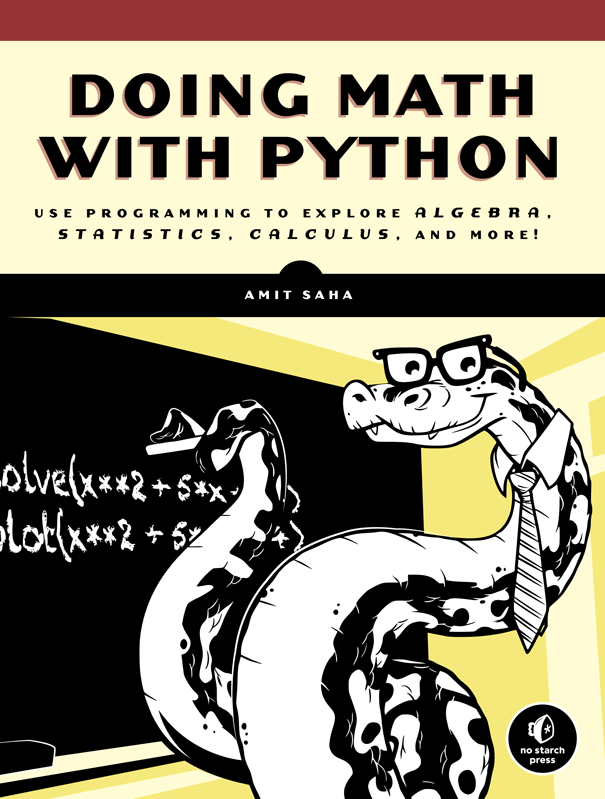

# Doing Math with Python

## info
* [publisher](https://www.nostarch.com/doingmathwithpython)  
* [github](https://github.com/doingmathwithpython/code)  

## toc
* [Chapter 1: Working with Numbers](Ch01_Working_with_Numbers.md)
* [Chapter 2: Visualizing Data with Graphs](Ch02_Visualizing_Data_with_Graphs.md)
* [Chapter 3: Describing Data with Statistics](Ch03_Describing_Data_with_Statistics.md)
* [Chapter 4: Algebra and Symbolic Math with SymPy](Ch04_Algebra_and_Symbolic_Math_with_SymPy.md)
* [Chapter 5: Playing with Sets and Probability](Ch05_Playing_with_Sets_and_Probability.md)
* [Chapter 6: Drawing Geometric Shapes and Fractals](Ch06_Drawing_Geometric_Shapes_and_Fractals.md)
* [Chapter 7: Solving Calculus Problems](Ch07_Solving_Calculus_Problems.md)