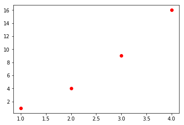
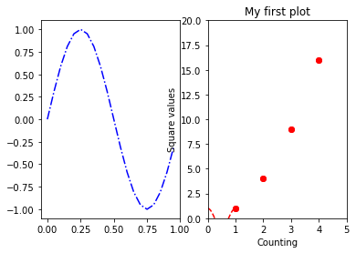
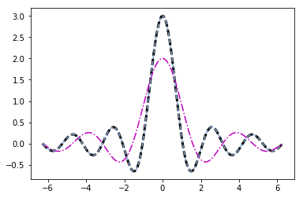

# Chapter 7: Data Visualization with matplotlib
<!-- toc orderedList:0 depthFrom:1 depthTo:6 -->

* [Chapter 7: Data Visualization with matplotlib](#chapter-7-data-visualization-with-matplotlib)
  * [7.1 The matplotlib Library](#71-the-matplotlib-library)
  * [7.2 Installation](#72-installation)
  * [7.3 IPython and IPython QtConsole](#73-ipython-and-ipython-qtconsole)
  * [7.4 matplotlib Architecture](#74-matplotlib-architecture)
    * [Backend Layer](#backend-layer)
    * [Artist Layer](#artist-layer)
    * [Scripting Layer (pyplot)](#scripting-layer-pyplot)
    * [pylab and pyplot](#pylab-and-pyplot)
  * [7.5 pyplot](#75-pyplot)
    * [A Simple Interactive Chart](#a-simple-interactive-chart)
    * [Set the Properties of the Plot](#set-the-properties-of-the-plot)
    * [matplotlib and NumPy](#matplotlib-and-numpy)
  * [7.6 Using the kwargs](#76-using-the-kwargs)
    * [Working with Multiple Figures and Axes](#working-with-multiple-figures-and-axes)
  * [7.7 Adding Further Elements to the Chart](#77-adding-further-elements-to-the-chart)
    * [Adding Text](#adding-text)
    * [Adding a Grid](#adding-a-grid)
    * [Adding a Legend](#adding-a-legend)
  * [7.8 Saving Your Charts](#78-saving-your-charts)
    * [Saving the Code](#saving-the-code)
    * [Converting Your Session as an HTML File](#converting-your-session-as-an-html-file)
    * [Saving Your Chart Directly as an Image](#saving-your-chart-directly-as-an-image)
  * [7.9 Handling Date Values](#79-handling-date-values)
  * [7.10 Chart Typology](#710-chart-typology)
  * [7.11 Line Chart](#711-line-chart)
    * [Line Charts with pandas](#line-charts-with-pandas)
  * [7.12 Histogram](#712-histogram)
  * [7.13 Bar Chart](#713-bar-chart)
    * [Horizontal Bar Chart](#horizontal-bar-chart)
    * [Multiserial Bar Chart](#multiserial-bar-chart)
    * [Multiseries Bar Chart with pandas DataFrame](#multiseries-bar-chart-with-pandas-dataframe)
    * [Multiseries Stacked Bar Charts](#multiseries-stacked-bar-charts)
    * [Stacked Bar Charts with pandas DataFrame](#stacked-bar-charts-with-pandas-dataframe)
    * [Other Bar Chart Representations](#other-bar-chart-representations)
  * [7.14 Pie Charts](#714-pie-charts)
    * [Pie Charts with pandas DataFrame](#pie-charts-with-pandas-dataframe)
  * [7.15 Advanced Charts](#715-advanced-charts)
    * [Contour Plot](#contour-plot)
    * [Polar Chart](#polar-chart)
  * [7.16 mplot3d](#716-mplot3d)
    * [3D Surfaces](#3d-surfaces)
    * [Scatter Plot in 3D](#scatter-plot-in-3d)
    * [Bar Chart 3D](#bar-chart-3d)
  * [7.17 Multi-Panel Plots](#717-multi-panel-plots)
    * [Display Subplots within Other Subplots](#display-subplots-within-other-subplots)
    * [Grids of Subplots](#grids-of-subplots)
  * [7.18 Conclusions](#718-conclusions)

<!-- tocstop -->


## 7.1 The matplotlib Library

## 7.2 Installation

## 7.3 IPython and IPython QtConsole

## 7.4 matplotlib Architecture

### Backend Layer

### Artist Layer

### Scripting Layer (pyplot)

### pylab and pyplot


```python
from pylab import *
```


```python
import matplotlib.pyplot as plt
import numpy as np
```


```python
plot(x,y)
array([1,2,3,4])
```


```python
plt.plot()
np.array([1,2,3,4]
```

## 7.5 pyplot

### A Simple Interactive Chart


```python
import matplotlib.pyplot as plt
```


```python
plt.plot([1,2,3,4])
```


    [<matplotlib.lines.Line2D at 0x5def11d390>]


```python
plt.show()
```


### Set the Properties of the Plot


```python
plt.plot([1,2,3,4],[1,4,9,16],'ro')
plt.show()
```





```python
plt.plot([1,2,3,4],[1,4,9,16],'ro')
```


    [<matplotlib.lines.Line2D at 0x5def28ab38>]


```python
plt.show()
```


```python
plt.axis([0,5,0,20])
plt.title('My first plot')
plt.plot([1,2,3,4],[1,4,9,16],'ro')
plt.show()
```


### matplotlib and NumPy


```python
import math
import numpy as np
t = np.arange(0,2.5,0.1)
```


```python
y1 = map(math.sin,math.pi*t)
```


```python
y2 = map(math.sin,math.pi*t+math.pi/2)
```


```python
y3 = map(math.sin,math.pi*t-math.pi/2)
```


```python
plt.plot(t,y1,'b*',t,y2,'g^',t,y3,'ys')
```


```python
plt.plot(t,y1,'b--',t,y2,'g',t,y3,'r-.')
```

## 7.6 Using the kwargs


```python
matplotlib.pyplot.plot(*args, **kwargs)
```


```python
plt.plot([1,2,4,2,1,0,1,2,1,4],linewidth=2.0)
```


    [<matplotlib.lines.Line2D at 0x5def5568d0>]


### Working with Multiple Figures and Axes


```python
t = np.arange(0,5,0.1)
y1 = np.sin(2*np.pi*t)
y2 = np.sin(2*np.pi*t)
```


```python
plt.subplot(211)
plt.plot(t,y1,'b-.')
plt.subplot(212)
plt.plot(t,y2,'r--')
```


    [<matplotlib.lines.Line2D at 0x5def598fd0>]


```python
t = np.arange(0.,1.,0.05)
y1 = np.sin(2*np.pi*t)
y2 = np.cos(2*np.pi*t)
plt.subplot(121)
```


    <matplotlib.axes._subplots.AxesSubplot at 0x5def61a6a0>


```python
plt.plot(t,y1,'b-.')
plt.subplot(122)
plt.plot(t,y2,'r--')
```


    [<matplotlib.lines.Line2D at 0x5def61a6d8>]


## 7.7 Adding Further Elements to the Chart

### Adding Text


```python
plt.axis([0,5,0,20])
plt.title('My first plot')
plt.xlabel('Counting')
plt.ylabel('Square values')
plt.plot([1,2,3,4],[1,4,9,16],'ro')
plt.show()
```





```python
plt.axis([0,5,0,20])
plt.title('My first plot',fontsize=20,fontname='Times New Roman')
plt.xlabel('Counting',color='gray')
plt.ylabel('Square values',color='gray')
plt.plot([1,2,3,4],[1,4,9,16],'ro')
plt.show()
```


```python
plt.axis([0,5,0,20])
plt.title('My first plot',fontsize=20,fontname='Times New Roman')
plt.xlabel('Counting',color='gray')
plt.ylabel('Square values',color='gray')
plt.text(1,1.5,'First')
plt.text(2,4.5,'Second')
plt.text(3,9.5,'Third')
plt.text(4,16.5,'Fourth')
plt.plot([1,2,3,4],[1,4,9,16],'ro')
plt.show()
```


```python
plt.axis([0,5,0,20])
plt.title('My first plot',fontsize=20,fontname='Times New Roman')
plt.xlabel('Counting',color='gray')
plt.ylabel('Square values',color='gray')
plt.text(1,1.5,'First')
plt.text(2,4.5,'Second')
plt.text(3,9.5,'Third')
plt.text(4,16.5,'Fourth')
plt.text(1.1,12,r'$y = x^2$',fontsize=20,bbox={'facecolor':'yellow','alpha':0.2})
plt.plot([1,2,3,4],[1,4,9,16],'ro')
plt.show()
```


### Adding a Grid


```python
plt.axis([0,5,0,20])
plt.title('My first plot',fontsize=20,fontname='Times New Roman')
plt.xlabel('Counting',color='gray')
plt.ylabel('Square values',color='gray')
plt.text(1,1.5,'First')
plt.text(2,4.5,'Second')
plt.text(3,9.5,'Third')
plt.text(4,16.5,'Fourth')
plt.text(1.1,12,r'$y = x^2$',fontsize=20,bbox={'facecolor':'yellow','alpha':0.2})
plt.grid(True)
plt.plot([1,2,3,4],[1,4,9,16],'ro')
plt.show()
```


### Adding a Legend


```python
plt.axis([0,5,0,20])
plt.title('My first plot',fontsize=20,fontname='Times New Roman')
plt.xlabel('Counting',color='gray')
plt.ylabel('Square values',color='gray')
plt.text(2,4.5,'Second')
plt.text(3,9.5,'Third')
plt.text(4,16.5,'Fourth')
plt.text(1.1,12,'$y = x^2$',fontsize=20,bbox={'facecolor':'yellow','alpha':0.2})
plt.grid(True)
plt.plot([1,2,3,4],[1,4,9,16],'ro')
plt.legend(['First series'])
plt.show()
```


```python
import matplotlib.pyplot as plt
plt.axis([0,5,0,20])
plt.title('My first plot',fontsize=20,fontname='Times New Roman')
plt.xlabel('Counting',color='gray')
plt.ylabel('Square values',color='gray')
plt.text(1,1.5,'First')
plt.text(2,4.5,'Second')
plt.text(3,9.5,'Third')
plt.text(4,16.5,'Fourth')
plt.text(1.1,12,'$y = x^2$',fontsize=20,bbox={'facecolor':'yellow','alpha':0.2})
plt.grid(True)
plt.plot([1,2,3,4],[1,4,9,16],'ro')
plt.plot([1,2,3,4],[0.8,3.5,8,15],'g^')
plt.plot([1,2,3,4],[0.5,2.5,4,12],'b*')
plt.legend(['First series','Second series','Third series'],loc=2)
plt.show()
```


## 7.8 Saving Your Charts

### Saving the Code


```python
import matplotlib.pyplot as plt
```


```python
# coding: utf-8
import matplotlib.pyplot as plt
plt.axis([0,5,0,20])
plt.title('My first plot',fontsize=20,fontname='Times New Roman')
plt.xlabel('Counting',color='gray')
plt.ylabel('Square values',color='gray')
plt.text(1,1.5,'First')
plt.text(2,4.5,'Second')
plt.text(3,9.5,'Third')
plt.text(4,16.5,'Fourth')
plt.text(1.1,12,'$y = x^2$',fontsize=20,bbox={'facecolor':'yellow','alpha':0.2})
plt.grid(True)
plt.plot([1,2,3,4],[1,4,9,16],'ro')
plt.plot([1,2,3,4],[0.8,3.5,8,15],'g^')
plt.plot([1,2,3,4],[0.5,2.5,4,12],'b*')
plt.legend(['First series','Second series','Third series'],loc=2)
plt.show()
```


### Converting Your Session as an HTML File

### Saving Your Chart Directly as an Image


```python
plt.axis([0,5,0,20])
plt.title('My first plot',fontsize=20,fontname='Times New Roman')
plt.xlabel('Counting',color='gray')
plt.ylabel('Square values',color='gray')
plt.text(1,1.5,'First')
plt.text(2,4.5,'Second')
plt.text(3,9.5,'Third')
plt.text(4,16.5,'Fourth')
plt.text(1.1,12,'$y = x^2$',fontsize=20,bbox={'facecolor':'yellow','alpha':0.2})
plt.grid(True)
plt.plot([1,2,3,4],[1,4,9,16],'ro')
plt.plot([1,2,3,4],[0.8,3.5,8,15],'g^')
plt.plot([1,2,3,4],[0.5,2.5,4,12],'b*')
plt.legend(['First series','Second series','Third series'],loc=2)
plt.savefig('my_chart.png')
```

## 7.9 Handling Date Values


```python
import datetime
import numpy as np
import matplotlib.pyplot as plt
events = [datetime.date(2015,1,23),datetime.date(2015,1,28),datetime.
date(2015,2,3),datetime.date(2015,2,21),datetime.date(2015,3,15),datetime.
date(2015,3,24),datetime.date(2015,4,8),datetime.date(2015,4,24)]
readings = [12,22,25,20,18,15,17,14]
plt.plot(events,readings)
plt.show()
```


```python
import datetime
import numpy as np
import matplotlib.pyplot as plt
import matplotlib.dates as mdates
months = mdates.MonthLocator()
days = mdates.DayLocator()
timeFmt = mdates.DateFormatter('%Y-%m')
events = [datetime.date(2015,1,23),datetime.date(2015,1,28),datetime.
date(2015,2,3),datetime.date(2015,2,21),datetime.date(2015,3,15),datetime.
date(2015,3,24),datetime.date(2015,4,8),datetime.date(2015,4,24)]
readings = [12,22,25,20,18,15,17,14]
fig, ax = plt.subplots()
plt.plot(events,readings)
ax.xaxis.set_major_locator(months)
ax.xaxis.set_major_formatter(timeFmt)
ax.xaxis.set_minor_locator(days)
plt.show()
```


## 7.10 Chart Typology

## 7.11 Line Chart


```python
import matplotlib.pyplot as plt
import numpy as np
x = np.arange(-2*np.pi,2*np.pi,0.01)
y = np.sin(3*x)/x
plt.plot(x,y)
plt.show()
```


```python
import matplotlib.pyplot as plt
import numpy as np
x = np.arange(-2*np.pi,2*np.pi,0.01)
y = np.sin(3*x)/x
y2 = np.sin(2*x)/x
y3 = np.sin(3*x)/x
plt.plot(x,y)
plt.plot(x,y2)
plt.plot(x,y3)
plt.show()
```


```python
import matplotlib.pyplot as plt
import numpy as np
x = np.arange(-2*np.pi,2*np.pi,0.01)
y = np.sin(3*x)/x
y2 = np.sin(2*x)/x
y3 = np.sin(3*x)/x
plt.plot(x,y,'k--',linewidth=3)
plt.plot(x,y2,'m-.')
plt.plot(x,y3,color='#87a3cc',linestyle='--')
plt.show()
```





```python
import matplotlib.pyplot as plt
import numpy as np
x = np.arange(-2*np.pi,2*np.pi,0.01)
y = np.sin(3*x)/x
y2 = np.sin(2*x)/x
y3 = np.sin(x)/x
plt.plot(x,y,color='b')
plt.plot(x,y2,color='r')
plt.plot(x,y3,color='g')
plt.xticks([-2*np.pi, -np.pi, 0, np.pi, 2*np.pi],
           [r'$-2\pi$',r'$-\pi$',r'$0$',r'$+\pi$',r'$+2\pi$'])
plt.yticks([-1,0,+1,+2,+3],
           [r'$-1$',r'$0$',r'$+1$',r'$+2$',r'$+3$'])
plt.show()
```


```python
import matplotlib.pyplot as plt
import numpy as np
x = np.arange(-2*np.pi,2*np.pi,0.01)
y = np.sin(3*x)/x
y2 = np.sin(2*x)/x
y3 = np.sin(x)/x
plt.plot(x,y,color='b')
plt.plot(x,y2,color='r')
plt.plot(x,y3,color='g')
plt.xticks([-2*np.pi, -np.pi, 0, np.pi, 2*np.pi],
           [r'$-2\pi$',r'$-\pi$',r'$0$',r'$+\pi$',r'$+2\pi$'])
plt.yticks([-1,0,+1,+2,+3],
           [r'$-1$',r'$0$',r'$+1$',r'$+2$',r'$+3$'])
ax = plt.gca()
ax.spines['right'].set_color('none')
ax.spines['top'].set_color('none')
ax.xaxis.set_ticks_position('bottom')
ax.spines['bottom'].set_position(('data',0))
ax.yaxis.set_ticks_position('left')
ax.spines['left'].set_position(('data',0))
plt.show()
```


```python
import matplotlib.pyplot as plt
import numpy as np
x = np.arange(-2*np.pi,2*np.pi,0.01)
y = np.sin(3*x)/x
y2 = np.sin(2*x)/x
y3 = np.sin(x)/x
plt.plot(x,y,color='b')
plt.plot(x,y2,color='r')
plt.plot(x,y3,color='g')
plt.xticks([-2*np.pi, -np.pi, 0, np.pi, 2*np.pi],
[r'$-2\pi$',r'$-\pi$',r'$0$',r'$+\pi$',r'$+2\pi$'])
plt.yticks([-1,0,+1,+2,+3],
           [r'$-1$',r'$0$',r'$+1$',r'$+2$',r'$+3$'])
plt.annotate(r'$\lim_{x\to 0}\frac{\sin(x)}{x}= 1$', xy=[0,1],xycoords='data',
             xytext=[30,30],fontsize=16,textcoords='offset points',arrowprops=dict(arrowstyle="->",
                                                                                   connectionstyle="arc3,rad=.2"))
ax = plt.gca()
ax.spines['right'].set_color('none')
ax.spines['top'].set_color('none')
ax.xaxis.set_ticks_position('bottom')
ax.spines['bottom'].set_position(('data',0))
ax.yaxis.set_ticks_position('left')
ax.spines['left'].set_position(('data',0))
plt.show()
```


### Line Charts with pandas


```python
import matplotlib.pyplot as plt
import numpy as np
import pandas as pd
data = {'series1':[1,3,4,3,5],
        'series2':[2,4,5,2,4],
        'series3':[3,2,3,1,3]}
df = pd.DataFrame(data)
x = np.arange(5)
plt.axis([0,5,0,7])
plt.plot(x,df)
plt.legend(data, loc=2)
plt.show()
```


## 7.12 Histogram


```python
import matplotlib.pyplot as plt
import numpy as np
pop = np.random.randint(0,100,100)
pop
```


    array([17, 90, 42,  8,  3, 23, 17, 83, 72, 29, 78, 64, 31, 33, 95, 91, 35,
            6, 13, 55,  5, 30, 71, 76, 10, 38, 66, 14, 10, 41, 44, 26, 55, 36,
           76, 44, 48, 65, 36, 30, 81, 57, 56, 12,  4, 67, 72, 68, 37, 77, 89,
           56, 95,  7, 64, 80, 36, 99, 59, 23, 98, 30, 65, 11, 89,  8, 22, 54,
           52, 81, 38, 81, 81, 31, 46, 95, 47, 25, 66, 58, 24, 45,  6, 13,  0,
           82, 85, 79, 39, 20, 75, 47, 71,  2, 10, 68, 96, 97, 78, 41])


```python
n,bins,patches = plt.hist(pop,bins=20)
plt.show()
```


## 7.13 Bar Chart


```python
import matplotlib.pyplot as plt
index = [0,1,2,3,4]
values = [5,7,3,4,6]
plt.bar(index,values)
plt.show()
```


```python
import numpy as np
index = np.arange(5)
values1 = [5,7,3,4,6]
plt.bar(index,values1)
plt.xticks(index+0.4,['A','B','C','D','E'])
plt.show()
```


```python
import numpy as np
index = np.arange(5)
values1 = [5,7,3,4,6]
std1 = [0.8,1,0.4,0.9,1.3]
plt.title('A Bar Chart')
plt.bar(index,values1,yerr=std1,error_kw={'ecolor':'0.1',
                                          'capsize':6},alpha=0.7,label='First')
plt.xticks(index+0.4,['A','B','C','D','E'])
plt.legend(loc=2)
plt.show()
```


### Horizontal Bar Chart


```python
import matplotlib.pyplot as plt
import numpy as np
index = np.arange(5)
values1 = [5,7,3,4,6]
std1 = [0.8,1,0.4,0.9,1.3]
plt.title('A Horizontal Bar Chart')
plt.barh(index,values1,xerr=std1,error_kw={'ecolor':'0.1','capsize':6},alpha=0.7,
label='First')
plt.yticks(index+0.4,['A','B','C','D','E'])
plt.legend(loc=5)
plt.show()
```


### Multiserial Bar Chart


```python
import matplotlib.pyplot as plt
import numpy as np
index = np.arange(5)
values1 = [5,7,3,4,6]
values2 = [6,6,4,5,7]
values3 = [5,6,5,4,6]
bw = 0.3
plt.axis([0,5,0,8])
plt.title('A Multiseries Bar Chart',fontsize=20)
plt.bar(index,values1,bw,color='b')
plt.bar(index+bw,values2,bw,color='g')
plt.bar(index+2*bw,values3,bw,color='r')
plt.xticks(index+1.5*bw,['A','B','C','D','E'])
plt.show()
```


```python
import matplotlib.pyplot as plt
import numpy as np
index = np.arange(5)
values1 = [5,7,3,4,6]
values2 = [6,6,4,5,7]
values3 = [5,6,5,4,6]
bw = 0.3
plt.axis([0,8,0,5])
plt.title('A Multiseries Horizontal Bar Chart',fontsize=20)
plt.barh(index,values1,bw,color='b')
plt.barh(index+bw,values2,bw,color='g')
plt.barh(index+2*bw,values3,bw,color='r')
plt.yticks(index+0.4,['A','B','C','D','E'])
plt.show()
```


### Multiseries Bar Chart with pandas DataFrame


```python
import matplotlib.pyplot as plt
import numpy as np
import pandas as pd
data = {'series1':[1,3,4,3,5],
        'series2':[2,4,5,2,4],
        'series3':[3,2,3,1,3]}
df = pd.DataFrame(data)
df.plot(kind='bar')
plt.show()
```


### Multiseries Stacked Bar Charts


```python
import matplotlib.pyplot as plt
import numpy as np
series1 = np.array([3,4,5,3])
series2 = np.array([1,2,2,5])
series3 = np.array([2,3,3,4])
index = np.arange(4)
plt.axis([0,4,0,15])
plt.bar(index,series1,color='r')
plt.bar(index,series2,color='b',bottom=series1)
plt.bar(index,series3,color='g',bottom=(series2+series1))
plt.xticks(index+0.4,['Jan15','Feb15','Mar15','Apr15'])
plt.show()
```


```python
import matplotlib.pyplot as plt
import numpy as np
index = np.arange(4)
series1 = np.array([3,4,5,3])
series2 = np.array([1,2,2,5])
series3 = np.array([2,3,3,4])
plt.axis([0,15,0,4])
plt.title('A Multiseries Horizontal Stacked Bar Chart')
plt.barh(index,series1,color='r')
plt.barh(index,series2,color='g',left=series1)
plt.barh(index,series3,color='b',left=(series1+series2))
plt.yticks(index+0.4,['Jan15','Feb15','Mar15','Apr15'])
plt.show()
```


```python
import matplotlib.pyplot as plt
import numpy as np
index = np.arange(4)
series1 = np.array([3,4,5,3])
series2 = np.array([1,2,2,5])
series3 = np.array([2,3,3,4])
plt.axis([0,15,0,4])
plt.title('A Multiseries Horizontal Stacked Bar Chart')
plt.barh(index,series1,color='w',hatch='xx')
plt.barh(index,series2,color='w',hatch='///', left=series1)
plt.barh(index,series3,color='w',hatch='\\\\\\',left=(series1+series2))
plt.yticks(index+0.4,['Jan15','Feb15','Mar15','Apr15'])
plt.show()
```


### Stacked Bar Charts with pandas DataFrame


```python
import matplotlib.pyplot as plt
import pandas as pd
data = {'series1':[1,3,4,3,5],
        'series2':[2,4,5,2,4],
        'series3':[3,2,3,1,3]}
df = pd.DataFrame(data)
df.plot(kind='bar', stacked=True)
plt.show()
```


```python

```

### Other Bar Chart Representations


```python
import matplotlib.pyplot as plt
x0 = np.arange(8)
y1 = np.array([1,3,4,6,4,3,2,1])
y2 = np.array([1,2,5,4,3,3,2,1])

plt.ylim(-7,7)
plt.bar(x0,y1,0.9,facecolor='r',edgecolor='w')
plt.bar(x0,-y2,0.9,facecolor='b',edgecolor='w')
plt.xticks(())
plt.grid(True)

for x, y in zip(x0, y1):
    plt.text(x + 0.4, y + 0.05, '%d' % y, ha='center', va= 'bottom')
for x, y in zip(x0, y2):
    plt.text(x + 0.4, -y - 0.05, '%d' % y, ha='center', va= 'top')

plt.show()
```


## 7.14 Pie Charts


```python
import matplotlib.pyplot as plt
labels = ['Nokia','Samsung','Apple','Lumia']
values = [10,30,45,15]
colors = ['yellow','green','red','blue']
plt.pie(values,labels=labels,colors=colors)
plt.axis('equal')
plt.show()
```


```python
import matplotlib.pyplot as plt
labels = ['Nokia','Samsung','Apple','Lumia']
values = [10,30,45,15]
colors = ['yellow','green','red','blue']
explode = [0.3,0,0,0]
plt.title('A Pie Chart')
plt.pie(values,labels=labels,colors=colors,explode=explode,startangle=180)
plt.axis('equal')
plt.show()
```


```python
import matplotlib.pyplot as plt
labels = ['Nokia','Samsung','Apple','Lumia']
values = [10,30,45,15]
colors = ['yellow','green','red','blue']
explode = [0.3,0,0,0]
plt.title('A Pie Chart')
plt.pie(values,labels=labels,colors=colors,explode=explode,
shadow=True,autopct='%1.1f%%',startangle=180)
plt.axis('equal')
plt.show()
```


### Pie Charts with pandas DataFrame


```python
import matplotlib.pyplot as plt
import pandas as pd
data = {'series1':[1,3,4,3,5],
        'series2':[2,4,5,2,4],
        'series3':[3,2,3,1,3]}
df = pd.DataFrame(data)
df['series1'].plot(kind='pie',figsize=(6,6))
plt.show()
```


## 7.15 Advanced Charts

### Contour Plot


```python
import matplotlib.pyplot as plt
import numpy as np
dx = 0.01; dy = 0.01
x = np.arange(-2.0,2.0,dx)
y = np.arange(-2.0,2.0,dy)
X,Y = np.meshgrid(x,y)
def f(x,y):
    return (1 - y**5 + x**5)*np.exp(-x**2-y**2)
C = plt.contour(X,Y,f(X,Y),8,colors='black')
plt.contourf(X,Y,f(X,Y),8)
plt.clabel(C, inline=1, fontsize=10)
plt.show()
```


```python
import matplotlib.pyplot as plt
import numpy as np
dx = 0.01; dy = 0.01
x = np.arange(-2.0,2.0,dx)
y = np.arange(-2.0,2.0,dy)
X,Y = np.meshgrid(x,y)
C = plt.contour(X,Y,f(X,Y),8,colors='black')
plt.contourf(X,Y,f(X,Y),8,cmap=plt.cm.hot)
plt.clabel(C, inline=1, fontsize=10)
plt.colorbar()
plt.show()
```


### Polar Chart


```python
import matplotlib.pyplot as plt
import numpy as np
N = 8
theta = np.arange(0.,2 * np.pi, 2 * np.pi / N)
radii = np.array([4,7,5,3,1,5,6,7])
plt.axes([0.025, 0.025, 0.95, 0.95], polar=True)
colors = np.array(['#4bb2c5', '#c5b47f', '#EAA228', '#579575', '#839557', '#958c12',
                   '#953579', '#4b5de4'])
bars = plt.bar(theta, radii, width=(2*np.pi/N), bottom=0.0, color=colors)
plt.show()
```


```python
import matplotlib.pyplot as plt
import numpy as np
N = 8
theta = np.arange(0.,2 * np.pi, 2 * np.pi / N)
radii = np.array([4,7,5,3,1,5,6,7])
plt.axes([0.025, 0.025, 0.95, 0.95], polar=True)
colors = np.array(['lightgreen', 'darkred', 'navy', 'brown', 'violet', 'plum',
'yellow', 'darkgreen'])
bars = plt.bar(theta, radii, width=(2*np.pi/N), bottom=0.0, color=colors)
plt.show()
```


## 7.16 mplot3d


```python
from mpl_toolkits.mplot3d import Axes3D
```


```python
from mpl_toolkits.mplot3d import Axes3D
import matplotlib.pyplot as plt
fig = plt.figure()
ax = Axes3D(fig)
X = np.arange(-2,2,0.1)
Y = np.arange(-2,2,0.1)
X,Y = np.meshgrid(X,Y)
def f(x,y):
    return (1 - y**5 + x**5)*np.exp(-x**2-y**2)
ax.plot_surface(X,Y,f(X,Y), rstride=1, cstride=1)
plt.show()
```


```python
from mpl_toolkits.mplot3d import Axes3D
import matplotlib.pyplot as plt
fig = plt.figure()
ax = Axes3D(fig)
X = np.arange(-2,2,0.1)
Y = np.arange(-2,2,0.1)
X,Y = np.meshgrid(X,Y)
def f(x,y):
    return (1 - y**5 + x**5)*np.exp(-x**2-y**2)
ax.plot_surface(X,Y,f(X,Y), rstride=1, cstride=1, cmap=plt.cm.hot)
ax.view_init(elev=30,azim=125)
plt.show()
```


### 3D Surfaces

### Scatter Plot in 3D


```python
import matplotlib.pyplot as plt
import numpy as np
from mpl_toolkits.mplot3d import Axes3D
xs = np.random.randint(30,40,100)
ys = np.random.randint(20,30,100)
zs = np.random.randint(10,20,100)
xs2 = np.random.randint(50,60,100)
ys2 = np.random.randint(30,40,100)
zs2 = np.random.randint(50,70,100)
xs3 = np.random.randint(10,30,100)
ys3 = np.random.randint(40,50,100)
zs3 = np.random.randint(40,50,100)
fig = plt.figure()
ax = Axes3D(fig)
ax.scatter(xs,ys,zs)
ax.scatter(xs2,ys2,zs2,c='r',marker='^')
ax.scatter(xs3,ys3,zs3,c='g',marker='*')
ax.set_xlabel('X Label')
ax.set_ylabel('Y Label')
ax.set_zlabel('Z Label')
plt.show()
```


### Bar Chart 3D


```python
import matplotlib.pyplot as plt
import numpy as np
from mpl_toolkits.mplot3d import Axes3D
x = np.arange(8)
y = np.random.randint(0,10,8)
y2 = y + np.random.randint(0,3,8)
y3 = y2 + np.random.randint(0,3,8)
y4 = y3 + np.random.randint(0,3,8)
y5 = y4 + np.random.randint(0,3,8)
clr = ['#4bb2c5', '#c5b47f', '#EAA228', '#579575', '#839557', '#958c12', '#953579', '#4b5de4']
fig = plt.figure()
ax = Axes3D(fig)
ax.bar(x,y,0,zdir='y',color=clr)
ax.bar(x,y2,10,zdir='y',color=clr)
ax.bar(x,y3,20,zdir='y',color=clr)
ax.bar(x,y4,30,zdir='y',color=clr)
ax.bar(x,y5,40,zdir='y',color=clr)
ax.set_xlabel('X Axis')
ax.set_ylabel('Y Axis')
ax.set_zlabel('Z Axis')
ax.view_init(elev=40)
plt.show()
```


## 7.17 Multi-Panel Plots

### Display Subplots within Other Subplots


```python
import matplotlib.pyplot as plt
fig = plt.figure()
ax = fig.add_axes([0.1,0.1,0.8,0.8])
inner_ax = fig.add_axes([0.6,0.6,0.25,0.25])
plt.show()
```


```python
import matplotlib.pyplot as plt
import numpy as np
fig = plt.figure()
ax = fig.add_axes([0.1,0.1,0.8,0.8])
inner_ax = fig.add_axes([0.6,0.6,0.25,0.25])
x1 = np.arange(10)
y1 = np.array([1,2,7,1,5,2,4,2,3,1])
x2 = np.arange(10)
y2 = np.array([1,3,4,5,4,5,2,6,4,3])
ax.plot(x1,y1)
inner_ax.plot(x2,y2)
plt.show()
```


### Grids of Subplots


```python
import matplotlib.pyplot as plt
gs = plt.GridSpec(3,3)
fig = plt.figure(figsize=(6,6))
fig.add_subplot(gs[1,:2])
fig.add_subplot(gs[0,:2])
fig.add_subplot(gs[2,0])
fig.add_subplot(gs[:2,2])
fig.add_subplot(gs[2,1:])
plt.show()
```


```python
import matplotlib.pyplot as plt
import numpy as np
gs = plt.GridSpec(3,3)
fig = plt.figure(figsize=(6,6))
x1 = np.array([1,3,2,5])
y1 = np.array([4,3,7,2])
x2 = np.arange(5)
y2 = np.array([3,2,4,6,4])
s1 = fig.add_subplot(gs[1,:2])
s1.plot(x,y,'r')
s2 = fig.add_subplot(gs[0,:2])
s2.bar(x2,y2)
s3 = fig.add_subplot(gs[2,0])
s3.barh(x2,y2,color='g')
s4 = fig.add_subplot(gs[:2,2])
s4.plot(x2,y2,'k')
s5 = fig.add_subplot(gs[2,1:])
s5.plot(x1,y1,'b^',x2,y2,'yo')
plt.show()
```


## 7.18 Conclusions


```python

```
