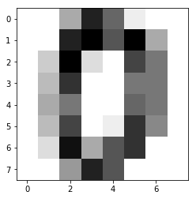
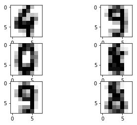

# Chapter 11: Recognizing Handwritten Digits
<!-- toc orderedList:0 depthFrom:1 depthTo:6 -->

* [Chapter 11: Recognizing Handwritten Digits](#chapter-11-recognizing-handwritten-digits)
  * [11.1 Handwriting Recognition](#111-handwriting-recognition)
  * [11.2 Recognizing Handwritten Digits with scikit-learn](#112-recognizing-handwritten-digits-with-scikit-learn)
  * [11.3 The Digits Dataset](#113-the-digits-dataset)
  * [11.4 Learning and Predicting](#114-learning-and-predicting)
  * [11.5 Conclusions](#115-conclusions)

<!-- tocstop -->


## 11.1 Handwriting Recognition

## 11.2 Recognizing Handwritten Digits with scikit-learn

http://scikit-learn.org/


```python
from sklearn import svm
svc = svm.SVC(gamma=0.001, C=100.)
```

## 11.3 The Digits Dataset


```python
from sklearn import datasets
digits = datasets.load_digits()
```


```python
print (digits.DESCR)
```

    Optical Recognition of Handwritten Digits Data Set
    ===================================================

    Notes
    -----
    Data Set Characteristics:
        :Number of Instances: 5620
        :Number of Attributes: 64
        :Attribute Information: 8x8 image of integer pixels in the range 0..16.
        :Missing Attribute Values: None
        :Creator: E. Alpaydin (alpaydin '@' boun.edu.tr)
        :Date: July; 1998

    This is a copy of the test set of the UCI ML hand-written digits datasets
    http://archive.ics.uci.edu/ml/datasets/Optical+Recognition+of+Handwritten+Digits

    The data set contains images of hand-written digits: 10 classes where
    each class refers to a digit.

    Preprocessing programs made available by NIST were used to extract
    normalized bitmaps of handwritten digits from a preprinted form. From a
    total of 43 people, 30 contributed to the training set and different 13
    to the test set. 32x32 bitmaps are divided into nonoverlapping blocks of
    4x4 and the number of on pixels are counted in each block. This generates
    an input matrix of 8x8 where each element is an integer in the range
    0..16. This reduces dimensionality and gives invariance to small
    distortions.

    For info on NIST preprocessing routines, see M. D. Garris, J. L. Blue, G.
    T. Candela, D. L. Dimmick, J. Geist, P. J. Grother, S. A. Janet, and C.
    L. Wilson, NIST Form-Based Handprint Recognition System, NISTIR 5469,
    1994.

    References
    ----------
      - C. Kaynak (1995) Methods of Combining Multiple Classifiers and Their
        Applications to Handwritten Digit Recognition, MSc Thesis, Institute of
        Graduate Studies in Science and Engineering, Bogazici University.
      - E. Alpaydin, C. Kaynak (1998) Cascading Classifiers, Kybernetika.
      - Ken Tang and Ponnuthurai N. Suganthan and Xi Yao and A. Kai Qin.
        Linear dimensionalityreduction using relevance weighted LDA. School of
        Electrical and Electronic Engineering Nanyang Technological University.
        2005.
      - Claudio Gentile. A New Approximate Maximal Margin Classification
        Algorithm. NIPS. 2000.


```python
digits.images[0]
```


    array([[  0.,   0.,   5.,  13.,   9.,   1.,   0.,   0.],
           [  0.,   0.,  13.,  15.,  10.,  15.,   5.,   0.],
           [  0.,   3.,  15.,   2.,   0.,  11.,   8.,   0.],
           [  0.,   4.,  12.,   0.,   0.,   8.,   8.,   0.],
           [  0.,   5.,   8.,   0.,   0.,   9.,   8.,   0.],
           [  0.,   4.,  11.,   0.,   1.,  12.,   7.,   0.],
           [  0.,   2.,  14.,   5.,  10.,  12.,   0.,   0.],
           [  0.,   0.,   6.,  13.,  10.,   0.,   0.,   0.]])


```python
import matplotlib.pyplot as plt
%matplotlib inline
plt.imshow(digits.images[0], cmap=plt.cm.gray_r, interpolation='nearest')
```


    <matplotlib.image.AxesImage at 0x100b59668>





```python
digits.target
```


    array([0, 1, 2, ..., 8, 9, 8])


```python
digits.target.size
```


    1797


## 11.4 Learning and Predicting


```python
import matplotlib.pyplot as plt
%matplotlib inline
plt.subplot(321)
plt.imshow(digits.images[1791], cmap=plt.cm.gray_r, interpolation='nearest')
plt.subplot(322)
plt.imshow(digits.images[1792], cmap=plt.cm.gray_r, interpolation='nearest')
plt.subplot(323)
plt.imshow(digits.images[1793], cmap=plt.cm.gray_r, interpolation='nearest')
plt.subplot(324)
plt.imshow(digits.images[1794], cmap=plt.cm.gray_r, interpolation='nearest')
plt.subplot(325)
plt.imshow(digits.images[1795], cmap=plt.cm.gray_r, interpolation='nearest')
plt.subplot(326)
plt.imshow(digits.images[1796], cmap=plt.cm.gray_r, interpolation='nearest')
```


    <matplotlib.image.AxesImage at 0x100dea9e8>





```python
svc.fit(digits.data[1:1790], digits.target[1:1790])
```


    SVC(C=100.0, cache_size=200, class_weight=None, coef0=0.0,
      decision_function_shape=None, degree=3, gamma=0.001, kernel='rbf',
      max_iter=-1, probability=False, random_state=None, shrinking=True,
      tol=0.001, verbose=False)


```python
svc.predict(digits.data[1791:1976])
```


    array([4, 9, 0, 8, 9, 8])


```python
digits.target[1791:1976]
```


    array([4, 9, 0, 8, 9, 8])


## 11.5 Conclusions


```python

```
