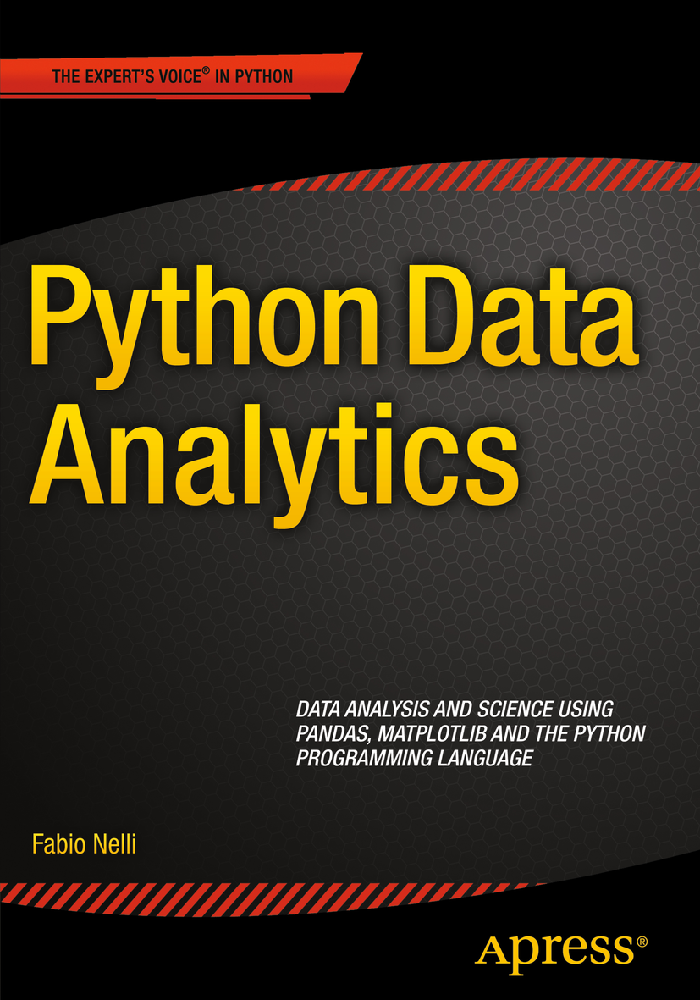

# Python Data Analytics

## info
* [publisher](http://www.apress.com/us/book/9781484209592)  
* [github](https://github.com/apress/python-data-analytics)  

## toc
* [Chapter 1: An Introduction to Data Analysis](Ch01_An_Introduction_to_Data_Analysis.md)  
* [Chapter 2: Introduction to the Python’s World](Ch02_Introduction_to_the_Pythons_World.md)  
* [Chapter 3: The NumPy Library](Ch03_The_NumPy_Library.md)  
* [Chapter 4: The pandas Library—An Introduction](Ch04_The_pandas_Library_An_Introduction.md)  
* [Chapter 5: pandas: Reading and Writing Data](Ch05_pandas_Reading_and_Writing_Data.md)  
* [Chapter 6: pandas in Depth: Data Manipulation](Ch06_pandas_in_Depth_Data_Manipulation.md)  
* [Chapter 7: Data Visualization with matplotlib](Ch07_Data_Visualization_with_matplotlib.md)  
* [Chapter 8: Machine Learning with scikit-learn](Ch08_Machine_Learning_with_scikit_learn.md)  
* [Chapter 9: An Example—Meteorological Data](Ch09_An_Example_Meteorological_Data.md)  
* [Chapter 10: Embedding the JavaScript D3 Library in IPython Notebook](Ch10_Embedding_the_JavaScript_D3_Library_in_IPython_Notebook.md)  
* [Chapter 11: Recognizing Handwritten Digits](Ch11_Recognizing_Handwritten_Digits.md)  
* [Appendix A: Writing Mathematical Expressions with LaTeX](AppA_Writing_Mathematical_Expressions_with_LaTeX.md)  
* [Appendix B: Open Data Sources](AppB_Open_Data_Sources.md)  