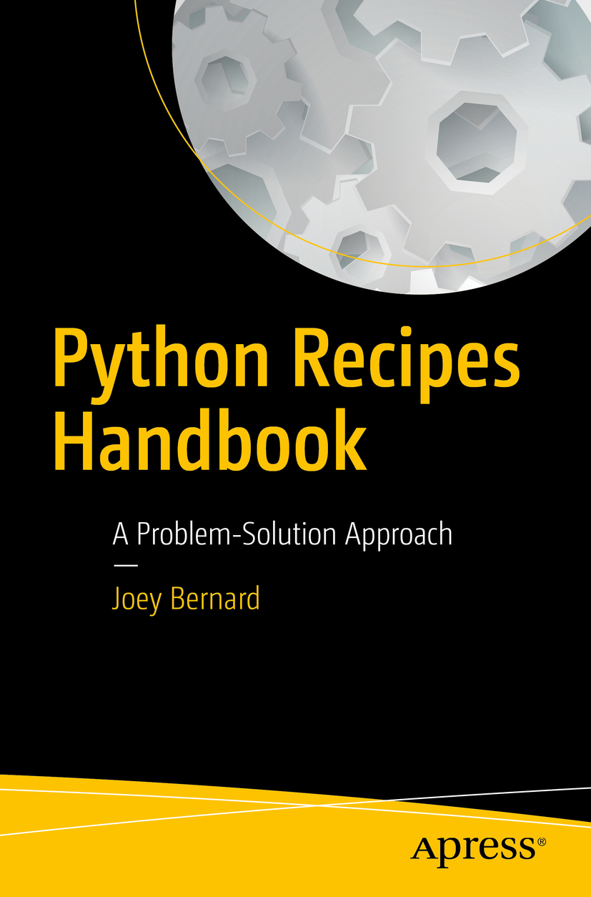

# Python Recipes Handbook

## info
* [publisher](http://www.apress.com/gp/book/9781484202425?wt_mc=ThirdParty.SpringerLink.3.EPR653.About_eBook)  

## toc
* [Chapter 1: Strings and Texts](Ch01_Strings_and_Texts.md)  
* [Chapter 2: Numbers, Dates, and Times](Ch02_Numbers_Dates_and_Times.md)  
* [Chapter 3: Iterators and Generators](Ch03_Iterators_and_Generators.md)  
* [Chapter 4: Files and I/O](Ch04_Files_and_IO.md)  
* [Chapter 5: Python Data Analysis with pandas](Ch05_Python_Data_Analysis_with_pandas.md)  
* [Chapter 6: Functions](Ch06_Functions.md)  
* [Chapter 7: Classes and Objects](Ch07_Classes_and_Objects.md)  
* [Chapter 8: Metaprogramming](Ch08_Metaprogramming.md)  
* [Chapter 9: Networking and the Internet](Ch09_Networking_and_the_Internet.md)  
* [Chapter 10: Modules and Packages](Ch10_Modules_and_Packages.md)  
* [Chapter 11: Numerics and Numpy](Ch11_Numerics_and_Numpy.md)  
* [Chapter 12: Concurrency](Ch12_Concurrency.md)  
* [Chapter 13: Utilities](Ch13_Utilities.md)  
* [Chapter 14: Testing and Debugging](Ch14_Testing_and_Debugging.md)  
* [Chapter 15: C and Other Extensions](Ch15_C_and_Other_Extensions.md)  
* [Chapter 16: Arduino and RPi Recipes](Ch16_Arduino_and_RPi_Recipes.md)  