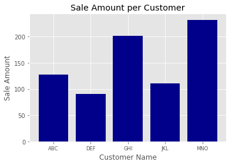
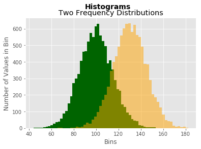
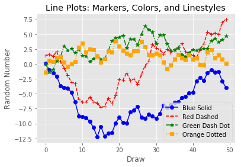
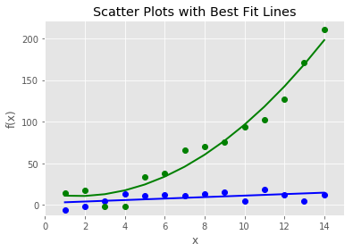
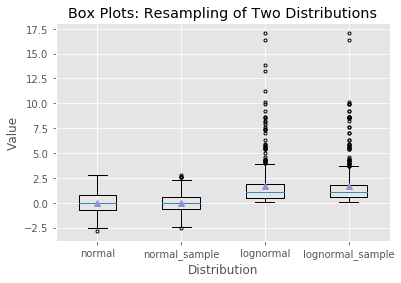
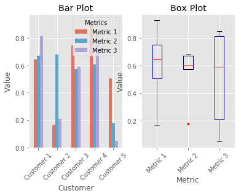
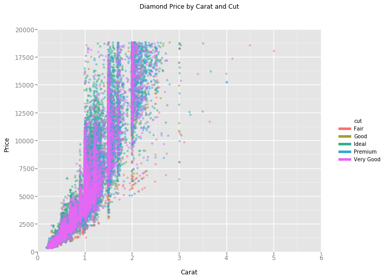
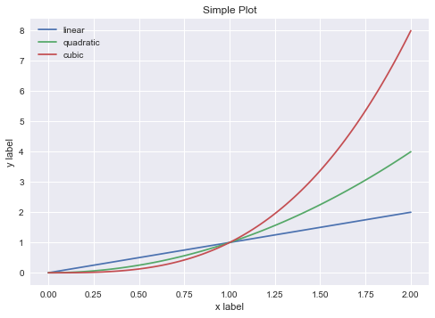

# Chapter6 Figures and Plots
<!-- toc orderedList:0 depthFrom:1 depthTo:6 -->

* [Chapter6 Figures and Plots](#chapter6-figures-and-plots)
	* [6.1 matplotlib](#61-matplotlib)
		* [6.1.1 長條圖](#611-長條圖)
		* [6.1.2 色階分布圖](#612-色階分布圖)
		* [6.1.3 線形圖](#613-線形圖)
		* [6.1.4 散布圖](#614-散布圖)
		* [6.1.5 盒鬚圖](#615-盒鬚圖)
	* [6.2 pandas](#62-pandas)
	* [6.3 ggplot](#63-ggplot)
	* [6.4 seaborn](#64-seaborn)

<!-- tocstop -->


## 6.1 matplotlib

### 6.1.1 長條圖


```python
# %load plots/matplotlib_basic_bar.py
#!/usr/bin/env python3
import matplotlib.pyplot as plt
plt.style.use('ggplot')

customers = ['ABC', 'DEF', 'GHI', 'JKL', 'MNO']
customers_index = range(len(customers))
sale_amounts = [127, 90, 201, 111, 232]

fig = plt.figure()
ax1 = fig.add_subplot(1,1,1)
ax1.bar(customers_index, sale_amounts, align='center', color='darkblue')
ax1.xaxis.set_ticks_position('bottom')
ax1.yaxis.set_ticks_position('left')
plt.xticks(customers_index, customers, rotation=0, fontsize='small')

plt.xlabel('Customer Name')
plt.ylabel('Sale Amount')
plt.title('Sale Amount per Customer')

plt.savefig('bar_plot.png', dpi=400, bbox_inches='tight')
plt.show()
```





### 6.1.2 色階分布圖


```python
# %load plots/matplotlib_basic_histogram.py
#!/usr/bin/env python3
import numpy as np
import matplotlib.pyplot as plt
plt.style.use('ggplot')

mu1, mu2, sigma = 100, 130, 15
x1 = mu1 + sigma*np.random.randn(10000)
x2 = mu2 + sigma*np.random.randn(10000)

fig = plt.figure()
ax1 = fig.add_subplot(1,1,1)
n, bins, patches = ax1.hist(x1, bins=50, normed=False, color='darkgreen')
n, bins, patches = ax1.hist(x2, bins=50, normed=False, color='orange', alpha=0.5)
ax1.xaxis.set_ticks_position('bottom')
ax1.yaxis.set_ticks_position('left')

plt.xlabel('Bins')
plt.ylabel('Number of Values in Bin')
fig.suptitle('Histograms', fontsize=14, fontweight='bold')
ax1.set_title('Two Frequency Distributions')

plt.savefig('histogram.png', dpi=400, bbox_inches='tight')
plt.show()
```





### 6.1.3 線形圖


```python
# %load plots/matplotlib_basic_line.py
#!/usr/bin/env python3
from numpy.random import randn
import matplotlib.pyplot as plt
plt.style.use('ggplot')

plot_data1 = randn(50).cumsum()
plot_data2 = randn(50).cumsum()
plot_data3 = randn(50).cumsum()
plot_data4 = randn(50).cumsum()

fig = plt.figure()
ax1 = fig.add_subplot(1,1,1)
ax1.plot(plot_data1, marker=r'o', color=u'blue', linestyle='-', label='Blue Solid')
ax1.plot(plot_data2, marker=r'+', color=u'red', linestyle='--', label='Red Dashed')
ax1.plot(plot_data3, marker=r'*', color=u'green', linestyle='-.', label='Green Dash Dot')
ax1.plot(plot_data4, marker=r's', color=u'orange', linestyle=':', label='Orange Dotted')
ax1.xaxis.set_ticks_position('bottom')
ax1.yaxis.set_ticks_position('left')

ax1.set_title('Line Plots: Markers, Colors, and Linestyles')
plt.xlabel('Draw')
plt.ylabel('Random Number')
plt.legend(loc='best')

plt.savefig('line_plot.png', dpi=400, bbox_inches='tight')
plt.show()
```





### 6.1.4 散布圖


```python
# %load plots/matplotlib_basic_scatter.py
#!/usr/bin/env python3
import numpy as np
import matplotlib.pyplot as plt
plt.style.use('ggplot')

x = np.arange(start=1., stop=15., step=1.)
y_linear = x + 5. * np.random.randn(14.)
y_quadratic = x**2 + 10. * np.random.randn(14.)

fn_linear = np.poly1d(np.polyfit(x, y_linear, deg=1))
fn_quadratic = np.poly1d(np.polyfit(x, y_quadratic, deg=2))

fig = plt.figure()
ax1 = fig.add_subplot(1,1,1)
ax1.plot(x, y_linear, 'bo', x, y_quadratic, 'go', \
			x, fn_linear(x), 'b-', x, fn_quadratic(x), 'g-', linewidth=2.)
ax1.xaxis.set_ticks_position('bottom')
ax1.yaxis.set_ticks_position('left')

ax1.set_title('Scatter Plots with Best Fit Lines')
plt.xlabel('x')
plt.ylabel('f(x)')
plt.xlim((min(x)-1., max(x)+1.))
plt.ylim((min(y_quadratic)-10., max(y_quadratic)+10.))

plt.savefig('scatter_plot.png', dpi=400, bbox_inches='tight')
plt.show()
```

    C:\Anaconda36\lib\site-packages\ipykernel\__main__.py:8: VisibleDeprecationWarning: using a non-integer number instead of an integer will result in an error in the future
    C:\Anaconda36\lib\site-packages\ipykernel\__main__.py:9: VisibleDeprecationWarning: using a non-integer number instead of an integer will result in an error in the future





### 6.1.5 盒鬚圖


```python
# %load plots/matplotlib_basic_boxplot.py
#!/usr/bin/env python3
import numpy as np
import matplotlib.pyplot as plt
plt.style.use('ggplot')

N = 500
normal = np.random.normal(loc=0.0, scale=1.0, size=N)
lognormal = np.random.lognormal(mean=0.0, sigma=1.0, size=N)
index_value = np.random.random_integers(low=0, high=N-1, size=N)
normal_sample = normal[index_value]
lognormal_sample = lognormal[index_value]
box_plot_data = [normal,normal_sample,lognormal,lognormal_sample]

fig = plt.figure()
ax1 = fig.add_subplot(1,1,1)

box_labels = ['normal','normal_sample','lognormal','lognormal_sample']
ax1.boxplot(box_plot_data, notch=False, sym='.', vert=True, whis=1.5, \
				showmeans=True, labels=box_labels)
ax1.xaxis.set_ticks_position('bottom')
ax1.yaxis.set_ticks_position('left')
ax1.set_title('Box Plots: Resampling of Two Distributions')
ax1.set_xlabel('Distribution')
ax1.set_ylabel('Value')

plt.savefig('box_plot.png', dpi=400, bbox_inches='tight')
plt.show()
```

    C:\Anaconda36\lib\site-packages\ipykernel\__main__.py:10: DeprecationWarning: This function is deprecated. Please call randint(0, 499 + 1) instead





## 6.2 pandas


```python
# %load plots/pandas_plots.py
#!/usr/bin/env python3
import pandas as pd
import numpy as np
import matplotlib.pyplot as plt
plt.style.use('ggplot')

fig, axes = plt.subplots(nrows=1, ncols=2)
ax1, ax2 = axes.ravel()

data_frame = pd.DataFrame(np.random.rand(5, 3),
						index=['Customer 1', 'Customer 2', 'Customer 3', 'Customer 4', 'Customer 5'],
						columns=pd.Index(['Metric 1', 'Metric 2', 'Metric 3'], name='Metrics'))

data_frame.plot(kind='bar', ax=ax1, alpha=0.75, title='Bar Plot')
plt.setp(ax1.get_xticklabels(), rotation=45, fontsize=10)
plt.setp(ax1.get_yticklabels(), rotation=0, fontsize=10)
ax1.set_xlabel('Customer')
ax1.set_ylabel('Value')
ax1.xaxis.set_ticks_position('bottom')
ax1.yaxis.set_ticks_position('left')

colors = dict(boxes='DarkBlue', whiskers='Gray', medians='Red', caps='Black')
data_frame.plot(kind='box', color=colors, sym='r.', ax=ax2, title='Box Plot')
plt.setp(ax2.get_xticklabels(), rotation=45, fontsize=10)
plt.setp(ax2.get_yticklabels(), rotation=0, fontsize=10)
ax2.set_xlabel('Metric')
ax2.set_ylabel('Value')
ax2.xaxis.set_ticks_position('bottom')
ax2.yaxis.set_ticks_position('left')

plt.savefig('pandas_plots.png', dpi=400, bbox_inches='tight')
plt.show()
```





## 6.3 ggplot


```python
# %load plots/ggplot_plots.py
#!/usr/bin/env python3
from ggplot import *
"""
print(mtcars.head())
plt1 = ggplot(aes(x='mpg'), data=mtcars) +\
 		geom_histogram(fill='darkblue', binwidth=2) +\
		xlim(10, 35) + ylim(0, 10) +\
		xlab("MPG") + ylab("Frequency") +\
		ggtitle("Histogram of MPG") +\
		theme_matplotlib()
print(plt1)

print(meat.head())
plt2 = ggplot(aes(x='date', y='beef'), data=meat) +\
		geom_line(color='purple', size=1.5, alpha=0.75) +\
		stat_smooth(colour='blue', size=2.0, span=0.15) +\
		xlab("Year") + ylab("Head of Cattle Slaughtered") +\
		ggtitle("Beef Consumption Over Time") +\
		theme_seaborn()
print(plt2)
"""
print(diamonds.head())
plt3 = ggplot(diamonds, aes(x='carat', y='price', colour='cut')) +\
		geom_point(alpha=0.5) +\
		scale_color_gradient(low='#05D9F6', high='#5011D1') +\
		xlim(0, 6) + ylim(0, 20000) +\
		xlab("Carat") + ylab("Price") +\
		ggtitle("Diamond Price by Carat and Cut") +\
		theme_gray()
print(plt3)

ggsave(plt3, "ggplot_plots.png")
```

       carat      cut color clarity  depth  table  price     x     y     z
    0   0.23    Ideal     E     SI2   61.5   55.0    326  3.95  3.98  2.43
    1   0.21  Premium     E     SI1   59.8   61.0    326  3.89  3.84  2.31
    2   0.23     Good     E     VS1   56.9   65.0    327  4.05  4.07  2.31
    3   0.29  Premium     I     VS2   62.4   58.0    334  4.20  4.23  2.63
    4   0.31     Good     J     SI2   63.3   58.0    335  4.34  4.35  2.75





    <ggplot: (-9223371973776587369)>


    ---------------------------------------------------------------------------

    NameError                                 Traceback (most recent call last)

    <ipython-input-1-8848f0a7b52c> in <module>()
         31 print(plt3)
         32
    ---> 33 ggsave(plt3, "ggplot_plots.png")


    NameError: name 'ggsave' is not defined


## 6.4 seaborn


```python
# %load plots/seaborn_plots.py
#!/usr/bin/env python3
import seaborn as sns
import numpy as np
import pandas as pd
import matplotlib.pyplot as plt

sns.set(color_codes=True)


# Simple plot of linear, quadratic, and cubic curves
x = np.linspace(0, 2, 100)
plt.plot(x, x, label='linear')
plt.plot(x, x**2, label='quadratic')
plt.plot(x, x**3, label='cubic')
plt.xlabel('x label')
plt.ylabel('y label')
plt.title("Simple Plot")
plt.legend(loc="best")
plt.show()


# Histogram
x = np.random.normal(size=1000)
sns.distplot(x, bins=20, kde=True, rug=False, label="Histogram w/o Density")
sns.axlabel("Value", "Frequency")
plt.title("Histogram of a Random Sample from a Normal Distribution")
plt.legend()
plt.show()


# Scatter plot
mean, cov = [5, 10], [(1, .5), (.5, 1)]
data = np.random.multivariate_normal(mean, cov, 200)
data_frame = pd.DataFrame(data, columns=["x", "y"])
sns.jointplot(x="x", y="y", data=data_frame, kind="reg").set_axis_labels("x", "y")
plt.suptitle("Joint Plot of Two Variables with Bivariate and Univariate Graphs")
plt.show()


# Pairwise bivariate
#iris = sns.load_dataset("iris")
#sns.pairplot(iris)
#plt.show()


# Linear regression model
tips = sns.load_dataset("tips")
#sns.lmplot(x="total_bill", y="tip", data=tips)
sns.lmplot(x="size", y="tip", data=tips, x_jitter=.15, ci=None)
#sns.lmplot(x="size", y="tip", data=tips, x_estimator=np.mean, ci=None)
plt.show()


# Box plots
sns.boxplot(x="day", y="total_bill", hue="time", data=tips)
#sns.factorplot(x="time", y="total_bill", hue="smoker",
#               col="day", data=tips, kind="box", size=4, aspect=.5)
plt.show()


# Bar plots
titanic = sns.load_dataset("titanic")
#sns.barplot(x="sex", y="survived", hue="class", data=titanic)
#sns.countplot(y="deck", hue="class", data=titanic, palette="Greens_d")
#plt.show()


# Non-linear regression model
anscombe = sns.load_dataset("anscombe")
# polynomial
#sns.lmplot(x="x", y="y", data=anscombe.query("dataset == 'II'"),
#           order=2, ci=False, scatter_kws={"s": 80})
#plt.show()


# robust to outliers
#sns.lmplot(x="x", y="y", data=anscombe.query("dataset == 'III'"),
#           robust=True, ci=False, scatter_kws={"s": 80})
#plt.show()


# logistic
#tips["big_tip"] = (tips.tip / tips.total_bill) > .15
#sns.lmplot(x="total_bill", y="big_tip", data=tips, logistic=True, y_jitter=.03).set_axis_labels("Total Bill", "Big Tip")
#plt.title("Logistic Regression of Big Tip vs. Total Bill")
#plt.show()


# lowess smoother
#sns.lmplot(x="total_bill", y="tip", data=tips, lowess=True)
#plt.show()


# Condition on other variables
#sns.lmplot(x="total_bill", y="tip", hue="smoker", data=tips,
#           markers=["o", "x"], palette="Set1")
#sns.lmplot(x="total_bill", y="tip", hue="smoker",
#           col="time", row="sex", data=tips)
#plt.show()


# Control shape and size of plot
#sns.lmplot(x="total_bill", y="tip", col="day", data=tips, col_wrap=2, size=3)
#sns.lmplot(x="total_bill", y="tip", col="day", data=tips, aspect=.5)
#plt.show()


# Plotting regression in other contexts
#sns.jointplot(x="total_bill", y="tip", data=tips, kind="reg")
#sns.pairplot(tips, x_vars=["total_bill", "size"], y_vars=["tip"],
#             size=5, aspect=.8, kind="reg")
#sns.pairplot(tips, x_vars=["total_bill", "size"], y_vars=["tip"],
#             hue="smoker", size=5, aspect=.8, kind="reg")
#plt.show()

```





    C:\Anaconda36\lib\site-packages\statsmodels\nonparametric\kdetools.py:20: VisibleDeprecationWarning: using a non-integer number instead of an integer will result in an error in the future
      y = X[:m/2+1] + np.r_[0,X[m/2+1:],0]*1j


    ---------------------------------------------------------------------------

    AttributeError                            Traceback (most recent call last)

    <ipython-input-16-fcf7150dbf90> in <module>()
         24 x = np.random.normal(size=1000)
         25 sns.distplot(x, bins=20, kde=True, rug=False, label="Histogram w/o Density")
    ---> 26 sns.axlabel("Value", "Frequency")
         27 plt.title("Histogram of a Random Sample from a Normal Distribution")
         28 plt.legend()


    AttributeError: module 'seaborn' has no attribute 'axlabel'


```python

```
