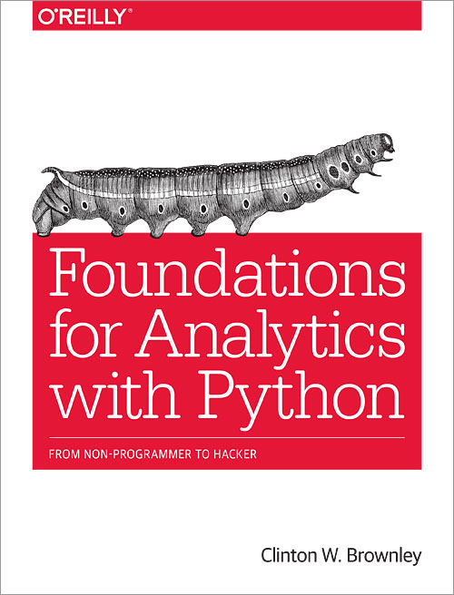

* **Publisher** http://shop.oreilly.com/product/0636920038375.do
* **File** https://github.com/cbrownley/foundations-for-analytics-with-python

## [Chapter1 Python Basics](Ch1_Python_Basics.md)
* How to Create a Python Script  
* How to Run a Python Script  
* Useful Tips for Interacting with the Command Line  
* Python’s Basic Building Blocks  
* Reading a Text File  
* Reading Multiple Text Files with glob  
* Writing to a Text File  
* print Statements  
* Chapter Exercises  

## [Chapter2 Comma-Separated Values (CSV) Files](Ch2_CommaSeparated_Values_Files.md)
* Base Python Versus pandas  
* Filter for Specific Rows  
* Select Specific Columns  
* Select Contiguous Rows  
* Add a Header Row  
* Reading Multiple CSV Files  
* Concatenate Data from Multiple Files  
* Sum and Average a Set of Values per File  
* Chapter Exercises  

## [Chapter3 Excel Files](Ch3_Excel_Files.md)
* Introspecting an Excel Workbook  
* Processing a Single Worksheet  
* Reading All Worksheets in a Workbook  
* Reading a Set of Worksheets in an Excel Workbook  
* Processing Multiple Workbooks  
* Chapter Exercises  

## [Chapter4 Databases](Ch4_Databases.md)
* Python's Built-in sqlite3 Module  
* MySQL Database  
* Chapter Exercises  

## [Chapter5 Applications](Ch5_Applications.md)
* Find a Set of Items in a Large Collection of Files  
* Calculate a Statistic for Any Number of Categories from Data in a CSV File  
* Calculate Statistics for Any Number of Categories from Data in a Text File  
* Chapter Exercises  

## [Chapter6 Figures and Plots](Ch6_Figures_and_Plots.md)
* matplotlib  
* pandas  
* ggplot  
* seaborn  

## [Chapter7 Descriptive Statistics and Modeling](Ch7_Descriptive_Statistics_and_Modeling.md)
* Datasets  
* Wine Quality  
* Customer Churn  

## [Chapter8 Scheduling Scripts to Run Automatically](Ch8_Scheduling_Scripts_to_Run_Automatically.md)
* Task Scheduler (Windows)  
* The cron Utility (macOS and Unix)  

## [Chapter9 Where to Go from Here](Ch9_Where_to_Go_from_Here.md)
* Additional Standard Library Modules and Built-in Functions  
* Python Package Index (PyPI): Additional Add-in Modules  
* Additional Data Structures  
* Where to Go from Here  

## Appendix Download Instructions  
* Download Python 3  
* Download the xlrd Package  
* Download the MySQL Database Server  
* Download mysqlclient (Python 3.x)/MySQL-python (Python 2.x)  

## Appendix Answers to Exercises  
